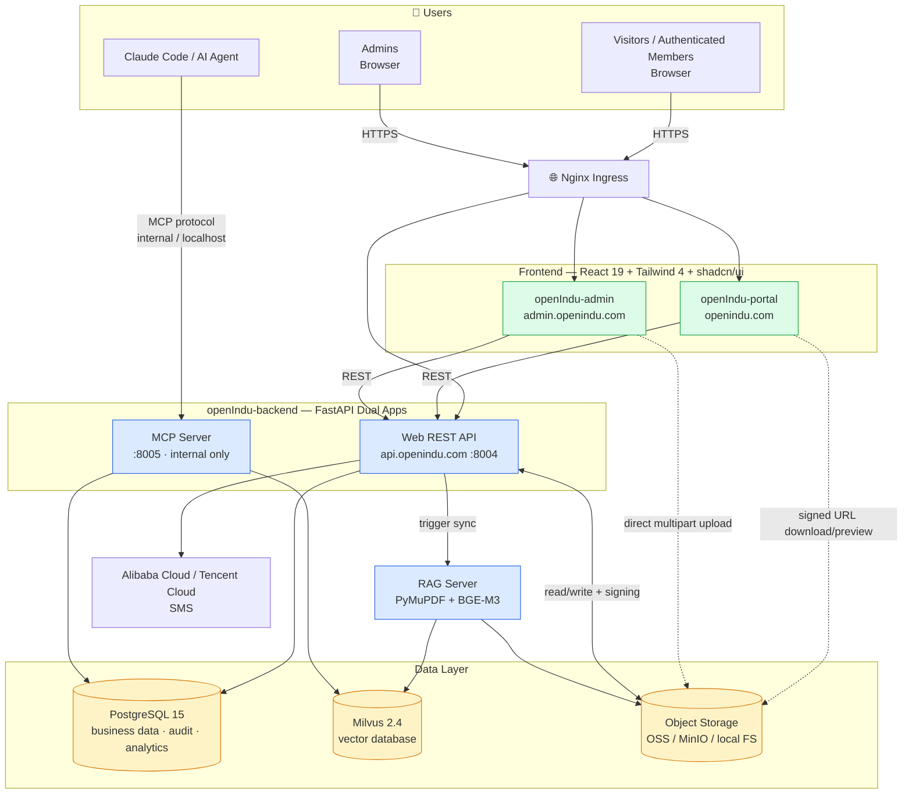

# openIndu-website

> **Language:** English | [中文](README_ZH.md)

The **aggregate repository** for the openIndu open-source industrial automation ecosystem, managing three deployable applications — Portal (community site), Admin (dashboard), and Backend (FastAPI + MCP) — via git submodules. The independently maintained [openIndu-studio](https://github.com/openIndu/openIndu-studio) project is no longer embedded in this repository.

> **Version**: `requirements.md` v0.13.0 (2026-07-10) | **Authoritative spec**: [`prod/requirements.md`](prod/requirements.md)

---

## Features at a Glance

- **Phone + SMS login**: JWT with jti deny-list + refresh rotation; admin blacklisting, forced logout, audit log
- **Three-tier tag system**: Brand -> Category -> Series, fully data-driven (`resource_tags`); operators change tags without code changes
- **Document & software download center**: pagination + filtering + inline preview; private bucket with 5-min presigned URLs
- **Browser-direct upload to OSS**: large packages (up to 5 GB) via `init / complete / abort` three-phase multipart, zero backend file bandwidth (see [`prod/requirements.md` section 4.3.6-2](prod/requirements.md#4362-upload-security-design-browser-direct-oss-large-files))
- **Storage backend abstraction**: `STORAGE_BACKEND=local | s3` one-line switch; local HMAC-signed direct links
- **Operations dashboard**: visitor analytics + online count + geographic distribution + today/this-month trends
- **Dual-track rate limiting**: document download 5/day, document preview 20/day, independent counters, admin exempt
- **MCP Server**: Claude Code queries the knowledge base via the MCP protocol (`search_plc_manual` and 7 other tool categories)
- **Publishing workflow**: document `is_published` + software version-level publishing + batch publishing

---

## Architecture Overview



**Key boundaries**:

- `Web API` is public-facing, with CORS + rate limiting + JWT; `MCP Server` is internal-only, with service-to-service auth
- `OSS` is a **private bucket**; all access goes through `Web API` issuing short-lived presigned URLs (production) or HMAC-signed direct links (local)
- File streams **do not pass through the backend** — downloads, previews, and uploads are all browser-to-OSS direct

---

## Direct OSS Upload Flow

See [`prod/requirements.md` section 4.3.6-2](prod/requirements.md#4362-upload-security-design-browser-direct-oss-large-files) — includes the full sequence diagram and protocol contract for the three-phase handshake, part signing, and local-mode fallback.

---

## Sub-repositories

| Sub-repo                                                           | Path                | Stack                                      |  Status  |
| ------------------------------------------------------------------ | ------------------- | ------------------------------------------ | :------: |
| [openIndu-backend](https://github.com/openIndu/openIndu-backend)   | `openIndu-backend/` | FastAPI · SQLAlchemy 2 · Milvus · boto3    | 🟢 active |
| [openIndu-admin](https://github.com/openIndu/openIndu-admin)       | `openIndu-admin/`   | React 19 · Vite 6 · Tailwind 4 · shadcn/ui | 🟢 active |
| [openIndu-portal](https://github.com/openIndu/openIndu-portal)     | `openIndu-portal/`  | React 19 · Vite 6 · Tailwind 4 · shadcn/ui | 🟢 active |

> Studio's earlier Vue frontend / FastAPI backend have been migrated out to portal, admin, and backend. Studio continues as an **independently maintained engineering-output generation engine + AI Agent workflow toolchain**, but is no longer embedded as a Website submodule. See [`prod/requirements.md` sections 2.2.8 / 4.3.13](prod/requirements.md) for future service-oriented plans.

---

## Quick Start

```bash
# 1. Clone the monorepo (with all sub-repos)
git clone --recurse-submodules https://github.com/openIndu/openIndu-website.git
cd openIndu-website

# 2. Create local env file from template
cp .env.example .env
# Edit .env to fill in OSS / SMS config; for local dev keep STORAGE_BACKEND=local

# 3. Start all services
docker compose up -d --build
```

**Local service ports**:

| Service          |  Port   | Description                      |
| ---------------- | :-----: | -------------------------------- |
| openIndu-portal  | `3000`  | Community site                   |
| openIndu-admin   | `3001`  | Admin dashboard                  |
| Web API          | `8004`  | REST API                         |
| MCP Server       | `8005`  | Claude Code knowledge retrieval  |
| PostgreSQL       | `5432`  | Business database                |
| Milvus           | `19530` | Vector database                  |

**Default admin**: phone `13800000000`, verification code `888888` (fixed for dev environment).

---

## Common Commands

```bash
# Sync all sub-repos to latest main
git submodule update --remote --recursive

# Develop inside a sub-repo
cd openIndu-backend
git checkout -b feat/my-feature
# ... make changes ...
git push origin feat/my-feature
gh pr create --repo openIndu/openIndu-backend --base main

# Back in the monorepo, commit the submodule pointer update
cd ..
git add openIndu-backend
git commit -m "chore: bump backend submodule"
```

---

## Documentation

- [**prod/requirements.md**](prod/requirements.md) — platform requirements doc (v0.13.0, the single authoritative requirements source)
- [CLAUDE.md](CLAUDE.md) — AI Agent developer entry guide
- [.claude/governance/](.claude/governance/) — repo-specific development workflows (for the principles themselves, see `/principle`)
- [design/](design/) — SDLC role artifact workspace (business / product / architecture / data / ops / UIUX / BI)

---

## Governance

This repo is governed by [openIndu/control-tower](https://github.com/openIndu/control-tower). The 11 RULEs and 20 role agents are distributed via the `openindu-control-tower@openindu` plugin. Every task starts with `/principle`:

- Prohibited: direct push to `main`/`master`; all changes go through feature branch + PR
- K8s deployment manifests belong in [openIndu/infra-deploy](https://github.com/openIndu/infra-deploy), not in this repo
- All feature development takes `prod/requirements.md` as the single requirements source
- Secrets (keys, passwords) must never be hardcoded; always use environment variables / K8s Secrets

---

## License

Apache-2.0
