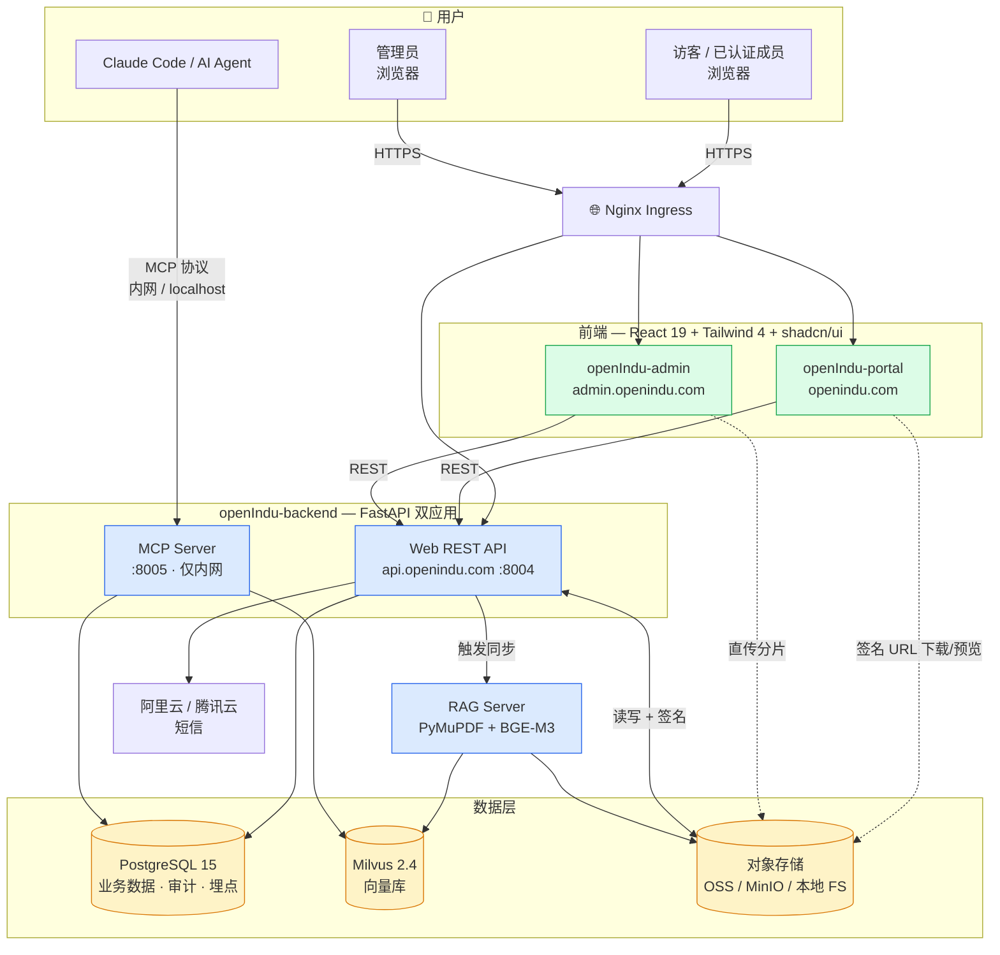

> **语言:** [English](README.md) | 中文

# openIndu-website

openIndu 开源工业自动化生态平台的**聚合开发仓**，通过 git submodule 统一管理 Portal（社区官网）、Admin（管理后台）和 Backend（FastAPI + MCP）三个可部署应用。独立维护的 [openIndu-studio](https://github.com/openIndu/openIndu-studio) 项目不再嵌入本仓。

> **版本**：`requirements.md` v0.13.0（2026-07-10）｜ **权威需求文档**：[`prod/requirements.md`](prod/requirements.md)

---

## ✨ 平台能力速览

- **手机号短信登录**：JWT + jti 黑名单 + refresh rotation；admin 拉黑/强制登出/审计日志
- **三层标签体系**：品牌 → 分类 → 系列，全数据驱动（`resource_tags`），运营改标签免改代码
- **文档/软件下载中心**：分页 + 筛选 + 在线预览，私有桶 + 5 分钟短期签名 URL
- **🚀 浏览器直传 OSS**：大软件包（≤5GB）`init / complete / abort` 三段式 multipart，后端零文件带宽（流程详见 [`prod/requirements.md` §4.3.6-2](prod/requirements.md#4362-上传安全设计浏览器直传-oss大文件)）
- **🗂️ 存储后端抽象**：`STORAGE_BACKEND=local | s3` 一键切换，本地 HMAC 签名直链
- **📊 运营数据看板**：访客埋点 + 在线人数 + 地理分布 + 今日·本月趋势
- **📑 双轨配额**：文档下载 5/天、文档预览 20/天，独立计数，admin 豁免
- **🧠 MCP Server**：Claude Code 通过 MCP 协议查询知识库（`search_plc_manual` 等 8 类工具）
- **🔄 发布工作流**：文档 `is_published` + 软件**版本级**发布 + 批量发布

---

## 🏗️ 架构总览



**关键边界**：

- `Web API` 面向公网，CORS + 限流 + JWT；`MCP Server` 仅内网，服务间认证
- `OSS` 为**私有桶**，所有访问经 `Web API` 签发短期 Presigned URL（生产）或 HMAC 签名直链（本地）
- 文件流**不经后端**——下载/预览/直传均由浏览器与 OSS 直连

---

## 🔁 直传 OSS 上传流程

详见 [`prod/requirements.md` §4.3.6-2](prod/requirements.md#4362-上传安全设计浏览器直传-oss大文件) — 含三段式握手、分片签名、本地模式回退的完整时序图与协议契约。

---

## 📦 子仓库

| 子仓库                                                           | 路径                | 技术栈                                     |  状态   |
| ---------------------------------------------------------------- | ------------------- | ------------------------------------------ | :-----: |
| [openIndu-backend](https://github.com/openIndu/openIndu-backend) | `openIndu-backend/` | FastAPI · SQLAlchemy 2 · Milvus · boto3    | 🟢 活跃 |
| [openIndu-admin](https://github.com/openIndu/openIndu-admin)     | `openIndu-admin/`   | React 19 · Vite 6 · Tailwind 4 · shadcn/ui | 🟢 活跃 |
| [openIndu-portal](https://github.com/openIndu/openIndu-portal)   | `openIndu-portal/`  | React 19 · Vite 6 · Tailwind 4 · shadcn/ui | 🟢 活跃 |

> Studio 早期的 Vue 前端 / FastAPI 后端已迁出至 portal·admin·backend，仓库本身继续作为**独立维护的工程产物生成引擎 + AI Agent 工作流工具链**，
> 但不再嵌入 Website 作为 submodule。对外服务化规划见 [`prod/requirements.md` §2.2.8 / §4.3.13](prod/requirements.md)。

---

## 🚀 快速开始

```bash
# 1. 克隆聚合仓（含所有子仓）
git clone --recurse-submodules https://github.com/openIndu/openIndu-website.git
cd openIndu-website

# 2. 从模板创建本地环境变量
cp .env.example .env
# 编辑 .env，填写 OSS / SMS 等配置；本地开发可保留 STORAGE_BACKEND=local

# 3. 一键启动所有服务
docker compose up -d --build
```

**本地服务端口**：

| 服务            |  端口   | 说明                         |
| --------------- | :-----: | ---------------------------- |
| openIndu-portal | `3000`  | 社区官网前台                 |
| openIndu-admin  | `3001`  | 统一管理后台                 |
| Web API         | `8004`  | REST API                     |
| MCP Server      | `8005`  | Claude Code 知识检索（内网） |
| PostgreSQL      | `5432`  | 业务数据库                   |
| Milvus          | `19530` | 向量数据库                   |

**默认管理员**：手机号 `13800000000`，验证码 `888888`（开发环境固定）。

---

## 🔧 常用命令

```bash
# 同步所有子仓到最新 main
git submodule update --remote --recursive

# 在某个子仓内开发
cd openIndu-backend
git checkout -b feat/my-feature
# ... 修改 ...
git push origin feat/my-feature
gh pr create --repo openIndu/openIndu-backend --base main

# 回到聚合仓提交 submodule 指针变更
cd ..
git add openIndu-backend
git commit -m "chore: bump backend submodule"
```

---

## 📚 文档

- [**prod/requirements.md**](prod/requirements.md) — 平台需求文档（v0.13.0，唯一权威需求来源）
- [CLAUDE.md](CLAUDE.md) — AI Agent 开发入口指南
- [.claude/governance/](.claude/governance/) — 本仓特有开发工作流（守则本身见 `/principle`）
- [design/](design/) — SDLC 角色产物工作区（业务/产品/架构/数据/运维/UIUX/BI）

---

## 🛡️ 治理

本仓受 [openIndu/control-tower](https://github.com/openIndu/control-tower) 统一管控，
守则（11 条 RULE）与 20 个角色 agent 由插件 `openindu-control-tower@openindu` 下发，任务第一步调用 `/principle`：

- ❌ **禁止**直接 push `main`/`master`，所有变更须走功能分支 + PR
- 🗂️ K8s 部署清单归口 [openIndu/infra-deploy](https://github.com/openIndu/infra-deploy)，本仓不存
- 📋 所有功能开发以 `prod/requirements.md` 为唯一需求来源
- 🔐 敏感信息（密钥/密码）禁止硬编码，统一走环境变量 / K8s Secret

---

## License

Apache-2.0
