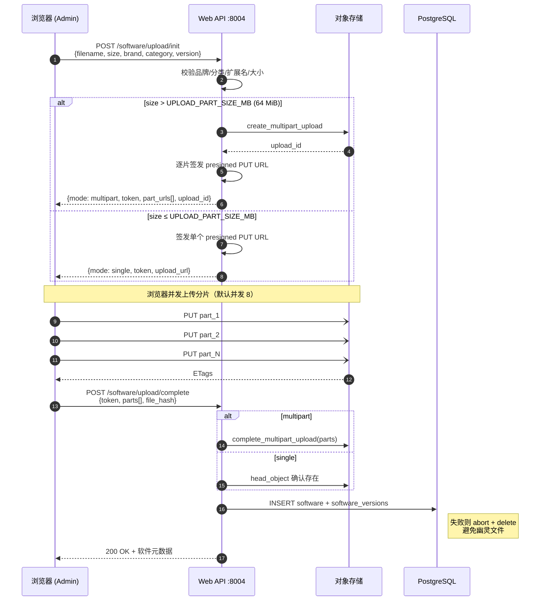

# openIndu 平台需求文档

> 版本: 0.9.3 | 日期: 2026-06-26 | 状态: 草案
>
> **状态标注**（本版起对功能点标注落地状态，区分「需求」与「已实现」，使文档与代码对齐）：
> ✅ 已实现 ｜ 🚧 部分实现 ｜ 📋 规划中（已立项未落地）。未标注者默认 ✅ 已实现。

---

## 0. 仓库迁移说明

openIndu 平台由以下独立仓库组成：

| 仓库 | 说明 | 代码来源 |
|------|------|---------|
| [openIndu-portal](https://gitee.com/openIndu/openIndu-portal) | 社区官网前台（React） | ✅ 已有，需改造（加登录页 + 工作流页 + API 对接） |
| [openIndu-admin](https://gitee.com/openIndu/openIndu-admin) | 统一管理后台（React） | 🆕 新建，从 `openIndu-studio/frontend` 重写（Vue → React） |
| [openIndu-backend](https://gitee.com/openIndu/openIndu-backend) | REST API 服务 + MCP 服务（FastAPI） | 🆕 新建，从 `openIndu-studio/backend` 迁移 + 扩展 |

> `openIndu-studio` 是早期原型仓库（Vue 3 前端 + FastAPI 后端），将在迁移完成后归档。

---

## 1. 概述

openIndu 是一个开源工业自动化生态平台，提供 AI 辅助的 PLC 程序开发工具链。平台由以下服务组成：

| 服务 | 域名/端口 | 定位 | 用户 |
|------|------|------|------|
| openIndu-portal | `openindu.com` | 社区官网前台 | 所有人（含未登录） |
| openIndu-admin | `admin.openindu.com` | 统一管理后台 | 已认证用户（按角色分级） |
| openIndu-backend (Web) | `api.openindu.com` | REST API（Portal + Admin） | 前端应用 |
| openIndu-backend (MCP) | `:8005` | MCP Server（Claude Code 知识检索） | Claude Code / AI Agent |

---

## 2. openIndu-portal — 社区官网前台

### 2.1 定位

面向公众的展示型网站，用于产品介绍、解决方案展示、社区引流，以及面向成员用户的 AI 工作流服务。内容由管理后台动态驱动。

### 2.2 功能模块

#### 2.2.1 首页

| 功能点 | 说明 | 优先级 |
|--------|------|:---:|
| Hero 区域 | 主标题、副标题、CTA 按钮，内容从 API 读取 | P0 |
| 平台截图轮播 | 产品功能截图轮播展示，图片从 API 读取 | P0 |
| 解决方案卡片 | 4 个核心解决方案（运动控制/视觉/IIoT/基础设施），从 API 读取 | P0 |
| 开源优势 | 4 个优势卡片（开源/社区/免费/贡献），从 API 读取 | P0 |
| 仓库链接 | GitHub + Gitee 仓库入口（前端硬编码） | P0 |
| CTA 区域 | 号召行动区域，引导用户参与 | P0 |

#### 2.2.2 登录/注册

| 功能点 | 说明 | 优先级 |
|--------|------|:---:|
| 手机号登录 | 输入手机号 → 发送短信验证码 → 输入验证码 → 登录 | P0 |
| 手机号注册 | 与登录页合并为统一认证入口；手机号不存在时自动注册（首个用户自动 admin） | P0 |
| 验证码重发 | 60 秒冷却后重新发送 | P0 |
| 登录态保持 | JWT access token（15min）+ refresh token（7d），前端 401 自动刷新并重放原请求 | P0 |
| 登录后跳转 | 登录成功后跳转到来源页，默认进入资源中心 | P1 |
| 个人中心 | 登录后显示个人中心入口（账号设置页 `AccountSettings.tsx`），可设置昵称；手机号仅脱敏展示 | P1 |
| 修改手机号 | 个人中心可换绑手机号（新号需短信验证码，`POST /auth/change-phone`） | P1 |
| 注销账号 | 个人中心可注销自己的账号（`DELETE /auth/me`） | P1 |
| 法律页面 | 隐私声明、法律声明、Cookies 等静态法律页（`LegalPages.tsx`） | P1 |
| 隐私声明确认 | 登录/注册前必须勾选同意隐私声明 | P1 |

> 登录采用**手机号 + 短信动态验证码**方式，无需设置密码。Portal 已将登录与注册合并为统一认证入口：用户输入手机号和验证码后，后端按手机号识别为登录或注册。验证码有效期 5 分钟，同一手机号每分钟限发 1 次，每日上限 10 条。短信服务对接阿里云短信或腾讯云短信。Refresh token 也记录 `jti`，支持拉黑时批量吊销，防止 refresh token 泄露后被滥用；前端在收到普通 API `401` 时先尝试 `/auth/refresh`，成功后重放原请求。
>
> **refresh rotation 并发约束**：后端每次 `/auth/refresh` 都会将旧 refresh token 的 `jti` 加入黑名单并签发新 token。Portal/Admin 前端必须做单飞刷新（同 tab 内请求排队、跨 tab 使用 `navigator.locks` 协调，另监听 `storage` 事件同步 token 变化），避免 React StrictMode 双执行或多标签页同时刷新导致第二次刷新命中已拉黑 jti 而被误登出。
>
> 手机号属于敏感信息，Portal 页面以及 Admin 的登录日志/审计日志/访问日志均仅允许脱敏展示。用户登录/注册前需阅读并勾选同意隐私声明。

#### 2.2.3 下载中心（面向成员）

> 原「资源浏览」已更名为「下载中心」（Download Center）。Portal 独立页面，对应前端 `Resources.tsx`。

| 功能点 | 说明 | 优先级 | 状态 |
|--------|------|:---:|:---:|
| 文档浏览 | 分页展示，支持品牌/分类/系列/关键词筛选 + chip 快捷筛选 + 每页条数选择，仅展示已发布文档 | P0 | ✅ |
| 文档在线预览 | member 及以上点击「预览」，浏览器内嵌渲染 PDF（后端签发 inline 签名 URL） | P0 | ✅ |
| 文档下载 | member 及以上可见下载按钮，调用后端校验后下载，每日限 5 次 | P0 | ✅ |
| 软件浏览 | 分页 + 筛选，**按版本拆分展示**（每个版本一行），显示文件大小与版本数 | P0 | ✅ |
| 软件下载 | member 及以上可下载指定版本，每日限 5 次 | P0 | ✅ |
| 切换标签防竞态 | 文档/软件标签切换时丢弃过期请求结果，避免错位 | P1 | ✅ |

> 下载中心是 Portal 独立页面。未登录用户可浏览列表；**预览与下载均需先登录且角色 ≥ member**。`user` 角色只能浏览列表。文档预览/下载、软件下载均经后端签发短期签名 URL（OSS 模式为 Presigned URL，本地模式为 HMAC 签名直链，详见 §4.3.6-2），用户直接获取文件，不经后端代理文件流。
>
> **每日下载限制**：文档和软件各独立计数，每个用户每天最多 5 次**下载**（基于 `download_logs` 表按当日统计），超限返回 429；**admin 角色豁免**。
>
> **文档在线预览采用独立限额**（v0.8.0 决策）：默认 20 次/天（`PREVIEW_DAILY_LIMIT`，`download_logs.resource_type=document_preview` 单独计数），**不占用下载额度、也不计入文档下载次数（download_count）**；超限同样返回 429，admin 豁免。预览仍设上限是为防止用预览接口绕过下载限制（inline 文件仍可另存）。

#### 2.2.4 工作流（面向成员）

| 功能点 | 说明 | 优先级 |
|--------|------|:---:|
| 工作流步骤展示 | 6 步 PLC 开发流程（电气模组→电路图→BOM→IO→PLC→HMI），每步展开详细说明 | P1 |
| AI Agent 工作流 | Claude Code 驱动的 Agent 工作流编排，通过 MCP 调用后端 | P2 |

> 工作流服务面向 **member** 及以上角色用户开放，在 Portal 上作为独立功能页面展示。Admin 后台不呈现工作流模块。

#### 2.2.5 子页面

> P1 阶段为静态页面（Markdown/HTML 硬编码），P2 阶段迁移为 Admin 后台可编辑的动态内容。

| 页面 | 说明 | 优先级 |
|------|------|:---:|
| 运动控制 | AI+运动控制解决方案介绍 | P1 |
| 视觉 | AI+视觉解决方案介绍 | P1 |
| IIoT 平台 | openIndu-platform 产品介绍 | P1 |
| 基础设施 | Token 服务等基础设施介绍 | P1 |

#### 2.2.6 SEO 与搜索引擎收录

| 功能点 | 说明 | 优先级 | 状态 |
|--------|------|:---:|:---:|
| 基础 meta | 首页与产品子页面按路由设置 title/description/keywords/og:image | P1 | ✅ |
| canonical | 统一规范域名为 `https://www.openindu.com`，每路由输出 canonical | P1 | ✅ |
| 结构化数据 | 输出 Organization / WebSite / SoftwareApplication 等 JSON-LD | P1 | ✅ |
| robots/sitemap | `public/robots.txt` 与 `public/sitemap.xml`，声明 sitemap 地址 | P1 | ✅ |
| 搜索站长验证 | Google Search Console + Baidu 站长平台 meta 验证 | P1 | ✅ |
| Baidu 主动推送 | 页面加载时接入百度自动推送脚本 | P2 | ✅ |

> Portal 是公开站点，允许搜索引擎抓取；Admin 是内部后台，禁止抓取（见 §3.3.8）。SEO 配置以静态前端文件和路由组件为主，部署域名规范为 `www.openindu.com`。

### 2.3 技术栈

| 技术 | 版本 | 用途 |
|------|------|------|
| React | 19.x | UI 框架 |
| TypeScript | 5.x | 类型安全 |
| Vite | 6.x | 构建工具 |
| Tailwind CSS | 4.x | 样式框架 |
| shadcn/ui | latest | UI 组件库 |
| React Router | 7.x | 路由管理 |
| Lucide React | latest | 图标库 |

### 2.4 选型理由

- **React**：Portal 已有 React 代码基础，社区生态最丰富
- **Tailwind CSS + shadcn/ui**：已有 Tailwind 基础，shadcn/ui 提供开箱即用的无障碍组件，与 Figma Make 导出风格一致
- **Vite**：构建速度快，开发体验好
- **React Router 7**：已有代码基础

---

## 3. openIndu-admin — 统一管理后台

### 3.1 定位

面向内部运营和技术人员的后台管理系统，用于管理官网内容、用户权限、文档知识库、软件资源和系统配置。

### 3.2 角色权限

| 角色 | 权限范围 |
|------|---------|
| `user` | 仅浏览文档列表和软件列表（不可下载） |
| `member` | 浏览 + 下载文档和软件 + 使用 Portal 工作流 |
| `admin` | 全部权限：官网内容管理、用户管理（拉黑/强制登出）、文档/软件上传与删除、系统配置、手动同步 |

### 3.3 功能模块

#### 3.3.1 官网内容（静态硬编码，不做后台管理）

> 📌 **决策（v0.8.0）**：官网首页内容（Hero、解决方案、轮播图、开源优势、页脚）**确定由 Portal 前端静态硬编码**，**不纳入 Admin 动态管理**。原「官网内容管理」CMS 模块已取消。
> - `Home.tsx` 直接内联 `solutions` 等内容，不调用 portal 内容 API；改文案需改前端代码并发版。
> - 后端 `api/portal.py` 仍保留 `hero`（GET）与 `solutions`（CRUD）端点、`portalApi` 客户端亦残留 hero/solutions/carousel 方法，均为**历史遗留/预留，当前前台首页未使用**。
> - 若未来重启动态 CMS，再行规划（补 carousel/benefits/footer 端点 + Admin 内容管理页）。

| 内容 | 当前承载 | 说明 |
|------|------|------|
| Hero / 解决方案 / 轮播图 / 开源优势 / 页脚 | Portal 前端静态硬编码 | 内容变更 = 改前端代码 + 发版，不经后台 |

#### 3.3.2 用户管理

| 功能点 | 说明 | 优先级 |
|--------|------|:---:|
| 用户列表 | 分页展示所有未软删除用户（手机号、角色、注册时间、最后登录、在线状态、登录 IP、登录地） | P0 |
| 角色分配 | 管理员修改用户角色（user/member/admin） | P0 |
| 拉黑用户 | 将用户设为黑名单状态，禁止登录 | P0 |
| 强制登出 | 使指定用户的所有 Token 立即失效，强制下线 | P0 |
| 解除拉黑 | 将黑名单用户恢复正常状态 | P1 |
| 软删除用户 | 管理员删除用户时仅设置 `deleted_at` 并吊销 token/会话；审计与历史访问/下载记录保留 | P1 ✅ |
| 在线统计 | 展示当前在线人数、登录地理位置分布（`OnlineStats.tsx`） | P1 |
| 操作日志 | 记录管理员对用户的操作历史，独立审计日志页（`AuditLogs.tsx`，`GET /admin/audit-logs`，手机号脱敏） | P2 ✅ |

**拉黑与强制登出机制**：

```
管理员操作"拉黑并强制登出"
        │
        ├── 1. 更新 users 表: is_active = false, is_blacklisted = true
        │
        ├── 2. 将该用户的所有 token 加入 token_blacklist 表
        │      （记录 jti + user_id + expires_at）
        │
        └── 3. 该用户的下一次请求 → 中间件校验 token
               → 发现 jti 在黑名单中 → 返回 401 "账号已被禁用"
```

> 无状态 JWT 无法主动失效已签发的 token。解决方案：维护 `token_blacklist` 表，每次请求校验 token 的 `jti`（JWT ID）是否在黑名单中。黑名单记录在 token 过期后自动清理。

**在线统计机制**：

```
每次 API 请求 → 中间件记录到 login_sessions 表
  ├── user_id
  ├── ip_address          ← 统一 real_client_ip()：优先 X-Forwarded-For / X-Real-IP，再 fallback request.client
  ├── user_agent
  ├── geo_location        ← 通过 ip2region 离线 xdb 解析；内网/回环 = 本地开发，失败 = 未知
  ├── last_active_at      ← 每次请求更新（按 UTC 存储，API 返回 ISO UTC）
  └── is_active           ← 5 分钟内无请求则标记为离线

定时任务（每分钟）→ 清理超过 5 分钟无活动的会话
在线人数 = SELECT COUNT(DISTINCT user_id) FROM login_sessions WHERE is_active = true
```

> 地理位置解析使用 `data/ip2region_v4.xdb`（`IP2REGION_XDB_PATH` 可覆盖），进程内懒加载为内存 searcher；缺少 xdb 或依赖时降级为「未知」，不阻塞应用启动。用户列表中的登录 IP/登录地优先选最近的公网会话，避免本地开发的 Docker 网关地址污染生产审计视图。

#### 3.3.2-1 数据看板（Dashboard）🆕

> Admin 登录后的着陆页（`Dashboard.tsx`），聚合平台运营指标。数据来源为 `visit_events`（访客埋点）+ `login_sessions`（登录会话）+ `users/documents/software` 统计。对应 `GET /api/v1/stats/dashboard`。

| 功能点 | 说明 | 优先级 | 状态 |
|--------|------|:---:|:---:|
| 总情况区 | 总会员人数、总文档数、总软件数、总访问人数（累计）、当前总访问人数 | P1 | ✅ |
| 实时访客 | `current_5m_uv` = 最近 5 分钟 UV（`client_id` 优先，历史数据按 IP fallback）；`current_5m_pv` = 最近 5 分钟页面访问次数 | P1 | ✅ |
| PV / UV | Dashboard 展示当前/今日/本月/累计 PV 与 UV；PV 为页面访问次数，UV 为独立访客数（新数据按浏览器 `client_id`，历史数据按 IP） | P1 | ✅ |
| 今日/本月 | 今日·本月活跃用户、新增用户/文档/软件 | P1 | ✅ |
| 趋势图 | 近 30 天每日注册/访客/登录、本月登录趋势、年度全量访问趋势、匿名访问趋势（零填充） | P1 | ✅ |
| 地理分布地图 | 访客 + 在线会话按地理位置聚合（含经纬度），地图点大小按流量分级 | P1 | ✅ |
| 标签使用统计 | 品牌/分类/系列标签使用量，支持展示未使用标签 | P2 | ✅ |
| 访问日志 | 展示匿名 + 已登录访问记录，支持关键词、登录/匿名、本地/未知过滤；时间统一按北京时间渲染 | P1 | ✅ |

**访客埋点机制**：Portal 前端在每次 SPA 路由导航时调用 `POST /api/v1/visits/track`（匿名亦记录），请求体携带浏览器级 `client_id` 与 `event_type=page_view`；后端解析真实客户端 IP 与地理位置写入 `visit_events` 表，区分已认证/匿名访客。看板 PV 按 `visit_events` 行数统计；UV 优先按 `client_id` 去重，历史无 `client_id` 的数据 fallback 到 `ip_address`。Portal 对同一路径 1 秒内重复埋点做轻量去重，避免 React StrictMode / effect 双执行虚增 PV。`client_id` 同时用于登录会话识别（见 `login_sessions.client_id`），即同一个浏览器标识同时服务 PV/UV 统计与在线会话隔离。

> 访问日志接口默认隐藏 `geo_location=本地开发`（内网/回环/Docker 网关）与 `geo_location=未知` 的记录，避免本地调试和无法解析 IP 干扰运营看板；需要排查时可通过参数显式包含。所有日志中的手机号均由后端脱敏后返回，前端不接收完整手机号。

#### 3.3.3 文档管理

> Admin 后台仅负责文档的**上传、编辑元数据、删除、发布和同步管理**。文档浏览/预览/下载属于 Portal 的消费功能（§2.2.3），不在 Admin 后台提供。

| 功能点 | 说明 | 优先级 | 状态 |
|--------|------|:---:|:---:|
| 文档列表 | 分页展示，支持按品牌/分类/系列/关键词筛选，显示下载次数（只读展示） | P0 | ✅ |
| 文档上传 | 上传 PDF，选择品牌、分类、系列（可选）；存入对象存储后**后台异步触发 RAG 同步** | P0 | ✅ |
| 文档编辑 | 修改品牌、分类、系列、描述、显示名（original_name）等元数据；不可修改文件本体 | P0 | ✅ |
| 文档发布 | 单个 `is_published` 上/下架开关 + **批量发布/取消**（按 ids 或品牌/分类/系列/关键词条件） | P0 | ✅ 🆕 |
| 文档删除 | 级联删除对象存储 + 数据库 + RAG 向量数据 | P0 | ✅ |
| 同步触发 | 手动触发单文档 RAG 同步（`POST /documents/{id}/sync`）/ OSS→RAG 全量同步 | P0 | ✅ |
| 同步状态 | 查看同步进度和日志 | P1 | ✅ |

> **发布控制**：`documents.is_published` 控制 Portal 是否展示。Portal 列表带 `published_only=true` 仅取已发布文档；Admin 列表展示全部。批量发布端点见 §4.3.5。

**文档分类体系**（存储于 `resource_tags` 表，type = `doc_category`，可在设置页维护）：

| 分类 | 值 | 说明 |
|------|------|------|
| PLC 编程手册 | `plc-manual` | PLC 编程手册（指令集、函数块、编程示例） |
| 硬件手册 | `hardware-manual` | 硬件选型、接线、安装、IO 模块手册 |
| 驱动器手册 | `driver-manual` | 伺服驱动器 / 变频器手册 |
| HMI 手册 | `hmi-manual` | 触摸屏 / HMI 编程手册 |
| 软件手册 | `software-manual` | 编程软件 / 组态软件使用手册 |
| 机器人手册 | `robot-manual` | 工业机器人控制器 / 编程手册 |
| 最佳实践 | `best-practice` | 行业最佳实践文档 |
| 电气规范 | `electrical-standard` | 电气设计规范与标准 |
| 其他 | `other` | 机器视觉、传感器、选型目录等其他类型 |

**品牌与系列管理**（见 §3.3.6）：品牌（`doc_brand`）、文档分类（`doc_category`）、产品系列（`doc_series`）均存储于 `resource_tags` 表，支持在设置页面增删查改，无需修改代码。

**OSS 文件命名规范**：`doc/{品牌中文}/{分类中文}/{品牌中文}-{分类中文}-{内容描述}.pdf`，例如：
```
doc/西门子/PLC/西门子-PLC-SIMATIC S7-1200 系统手册.pdf
doc/三菱/驱动器/三菱-驱动器-MELSERVO-J4 伺服放大器手册.pdf
```

#### 3.3.4 软件管理

> Admin 后台仅负责软件的**上传、删除、发布和版本管理**。软件浏览和下载属于 Portal 的消费功能（§2.2.3），不在 Admin 后台提供。

| 功能点 | 说明 | 优先级 | 状态 |
|--------|------|:---:|:---:|
| 软件列表 | 分页 + 筛选，显示下载次数、文件大小、版本数；支持 `expand_versions` **按版本展开**（每版本一行） | P0 | ✅ |
| 软件上传 | 上传软件包（zip/exe/msi/rar/7z），选品牌/分类/版本号；**浏览器直传 OSS**（大包 5GB+，见 §4.3.6-2），带上传进度条 | P0 | ✅ 🆕 |
| 版本管理 | 为已有软件新增版本、删除指定版本；每版本保留独立显示名（original_name） | P0 | ✅ 🆕 |
| 软件发布 | **版本级发布**：单版本 toggle + 批量发布/取消（version_ids 或 software ids 或条件）；`Software.is_published` 为「任一版本已发布」的派生镜像 | P0 | ✅ 🆕 |
| 软件编辑 | 修改品牌、分类、描述、显示名等元数据 | P1 | ✅ |
| 软件删除 | 级联删除对象存储 + 数据库（含全部版本） | P0 | ✅ |

> **发布模型（重要）**：软件发布粒度为**版本**（`software_versions.is_published`），而非软件整体。`software.is_published` 仅作兼容镜像（= 任一版本已发布）。Portal 带 `published_only` 时按版本过滤。批量/单项发布端点见 §4.3.6。

**软件分类体系**：

| 分类 | 值 | 说明 |
|------|------|------|
| PLC 编程软件 | `plc-ide` | PLC 编程 IDE（如 TIA Portal、GX Works3、Sysmac Studio、KV Studio） |
| HMI 编程软件 | `hmi-ide` | HMI/触摸屏编程软件（如 WinCC、GT Designer3、NB-Designer） |
| 驱动软件 | `plc-driver` | PLC 通信驱动、USB 驱动、OPC 服务器 |
| 调试工具 | `utility` | 调试、诊断、仿真工具软件 |
| 固件升级 | `firmware` | PLC/HMI/驱动器固件升级包 |
| 其他 | `other` | 其他类型软件 |

> 软件管理与文档管理共享相同的角色权限模型。软件包存储在 OSS 中，以 `soft/` 前缀区分。

#### 3.3.6 品牌与分类管理（设置中心）

> 品牌、文档分类、软件分类、**文档**产品系列均从数据库动态读取，通过设置页面维护，无需改代码。

| 功能点 | 说明 | 优先级 |
|--------|------|:---:|
| 品牌管理 | 增删改品牌标签（`doc_brand` / `sw_brand`），含中文名称、slug、启用/停用 | P0 |
| 文档分类管理 | 增删改文档分类（`doc_category`） | P0 |
| 软件分类管理 | 增删改软件分类（`sw_category`） | P0 |
| 系列管理 | 增删改**文档**产品系列（`doc_series`），关联所属品牌和分类 | P0 |
| 排序 | 每类标签可配置 sort_order 控制下拉顺序 | P1 |

> ♻️ **变更**：**软件系列（`sw_series`）已移除并清理历史债务**——标签管理 UI 与上传表单不再提供软件系列；后端不再接受/返回 `software.series`，数据库迁移 `20260626_remove_software_series` 删除 `software.series` 残留列并清理历史 `sw_series` 标签。软件仅按品牌、分类与版本管理。

#### 3.3.7 系统配置

系统配置采用**混合分层策略**：

| 配置类型 | 存储位置 | 修改方式 | 生效方式 | 示例 |
|---------|---------|---------|---------|------|
| **基础设施连接** | 环境变量 / K8s ConfigMap | 运维修改部署配置 | 重启生效 | 数据库地址、Milvus 地址、OSS Endpoint |
| **敏感凭证** | K8s Secret / 环境变量 | 运维注入 | 重启生效 | OSS AK/SK、短信服务密钥、JWT 密钥、MCP API Key |
| **业务参数** | 数据库 `system_configs` 表 | Admin 后台页面 | 即时生效 | Embedding 模型、分块大小、同步间隔 |

> Admin 后台的「系统配置」页面仅保留**业务参数**部分。基础设施和凭证类配置由运维通过部署配置管理，不在后台暴露。

| 功能点 | 说明 | 优先级 |
|--------|------|:---:|
| Embedding 配置 | 模型名称、运行设备（CPU/CUDA） | P0 |
| 分块参数 | chunk_size、chunk_overlap | P1 |
| 同步间隔 | 定时同步间隔（分钟） | P1 |

#### 3.3.8 后台搜索引擎策略

| 功能点 | 说明 | 优先级 | 状态 |
|--------|------|:---:|:---:|
| 禁止索引 | `index.html` 输出 `<meta name="robots" content="noindex, nofollow" />` | P1 | ✅ |
| robots.txt | `public/robots.txt` 禁止搜索引擎抓取后台路径 | P1 | ✅ |

> Admin 是内部运营后台，所有页面必须要求认证且不应被搜索引擎收录；SEO 工作仅面向 Portal 公网站点。

### 3.4 Admin 实际页面清单（as-built）

> 以下为当前 `openIndu-admin/src/app/pages/` 实际存在的页面，供对照需求落地范围：

| 页面 | 文件 | 对应模块 |
|------|------|---------|
| 数据看板 | `Dashboard.tsx` | §3.3.2-1 |
| 用户列表 / 详情 | `users/UserList.tsx`、`users/UserDetail.tsx` | §3.3.2 |
| 在线统计 | `stats/OnlineStats.tsx` | §3.3.2 |
| 统计访问日志 | `stats/OnlineStats.tsx`（访问日志 tab） | §3.3.2-1 |
| 审计日志 | `stats/AuditLogs.tsx` | §3.3.2 |
| 文档列表 / 上传 | `documents/DocumentList.tsx`、`documents/DocumentUpload.tsx` | §3.3.3 |
| 软件列表 / 上传 | `software/SoftwareList.tsx`、`software/SoftwareUpload.tsx` | §3.3.4 |
| 设置 / 标签管理 | `settings/SettingsView.tsx`、`settings/TagsView.tsx` | §3.3.6 / §3.3.7 |
| 登录 | `Login.tsx` | §2.2.2 |

> 📌 **说明**：无「官网内容管理」页面属**设计决策**——官网内容已定为 Portal 前端静态硬编码（§3.3.1），非实现缺口。

---

## 4. openIndu-backend — 后端服务

### 4.1 架构：双服务模式

后端采用**一个代码仓库、两个 FastAPI 应用**的架构：

```
openIndu-backend/
├── app/
│   ├── web_app.py              ← FastAPI App 1: Web REST API
│   │   ├── api/auth.py         ← 短信登录/注册/JWT/改手机号/注销
│   │   ├── api/portal.py       ← 官网内容（hero 只读 + solutions CRUD）
│   │   ├── api/users.py        ← 用户管理（拉黑/强制登出）
│   │   ├── api/admin.py        ← 管理员审计日志 🆕
│   │   ├── api/documents.py    ← 文档 CRUD + 预览/下载 + 发布 + 同步
│   │   ├── api/software.py     ← 软件/版本 CRUD + 直传 OSS + 发布
│   │   ├── api/files.py        ← 本地存储文件下载（签名校验）🆕
│   │   ├── api/sync.py         ← 同步任务
│   │   ├── api/config.py       ← 业务参数配置
│   │   ├── api/tags.py         ← 品牌/分类/系列标签 CRUD
│   │   ├── api/brand_mapping.py
│   │   ├── api/stats.py        ← 在线统计 + 数据看板 🆕
│   │   └── api/visits.py       ← 访客埋点 🆕
│   │
│   ├── mcp_app.py              ← FastAPI App 2: MCP Server
│   │   └── mcp/
│   │       ├── server.py       ← MCP 协议处理
│   │       └── tools.py        ← MCP 工具定义（search_plc_manual 等）
│   │
│   ├── models/                 ← 共享数据模型（含 visit_event 🆕）
│   ├── services/               ← 共享业务逻辑
│   │   ├── storage_service.py  ← 存储门面：local/OSS 路由 🆕
│   │   ├── file_storage.py     ← 本地文件系统后端 🆕
│   │   ├── oss_service.py      ← OSS/S3 后端（含 multipart 直传）
│   │   ├── milvus_service.py / rag_sync_service.py / geo_service.py / auth_service.py
│   ├── core/                   ← 共享配置/依赖/工具（utils.ok 统一响应）
│   ├── tasks/                  ← 定时任务
│   └── middleware/             ← 共享中间件（token 黑名单校验、在线统计）
│
├── requirements.txt
├── Dockerfile
└── docker-compose.yml
```

### 4.2 为什么需要两个独立应用？

| 维度 | Web REST API（:8004） | MCP Server（:8005） |
|------|------|------|
| **协议** | HTTP REST（JSON） | MCP Protocol（JSON-RPC over SSE/stdio） |
| **认证方式** | JWT Bearer Token（用户登录态） | API Key / MCP 内置认证（服务间调用） |
| **调用方** | Portal 前端 + Admin 前端 | Claude Code / AI Agent |
| **安全边界** | 面向公网，需要 CORS、限流、XSS 防护 | 仅内网或 localhost，Claude Code 直连 |
| **请求模式** | CRUD 操作、文件上传下载 | 语义搜索、知识检索 |
| **错误处理** | HTTP 状态码 + JSON 错误体 | MCP 标准错误格式 |
| **文档生成** | Swagger UI / ReDoc（给前端开发者看） | MCP 工具清单（给 AI Agent 看） |
| **部署** | 可公网暴露 | 仅内网 / localhost |

**分开的好处**：
1. **安全隔离**：MCP 服务不需要暴露到公网，不需要 CORS 和 JWT 认证
2. **独立扩缩容**：Web API 可能被大量用户访问，MCP 只被 AI Agent 调用，资源需求不同
3. **独立部署**：Web API 变更不影响 MCP 服务，反之亦然
4. **代码共享**：共享 models、services、core 层，不重复造轮子

### 4.3 Web REST API 端点

#### 4.3.1 认证模块 (`/api/v1/auth`)

> 采用**手机号 + 短信动态验证码**认证，无密码体系。Portal/Admin 前端在普通 API 返回 401 时先尝试 refresh token 自动续期，refresh 成功后重放原请求；refresh token 本身 401 或缺失时才清理本地登录态并跳转登录页。

| 端点 | 方法 | 说明 | 权限 |
|------|------|------|------|
| `/auth/send-code` | POST | 发送短信验证码（60s 冷却，5min 有效） | 公开 |
| `/auth/login` | POST | 手机号 + 验证码登录，返回 JWT（含 jti） | 公开 |
| `/auth/register` | POST | 手机号 + 验证码注册，首个用户自动 admin | 公开 |
| `/auth/refresh` | POST | 刷新 access token | 公开 |
| `/auth/me` | GET | 获取当前用户信息 | 登录 |
| `/auth/me` | PATCH | 更新当前用户资料（昵称等） | 登录 |
| `/auth/me` | DELETE | 注销当前账号 🆕 | 登录 |
| `/auth/change-phone` | POST | 换绑手机号（新号需短信验证码）🆕 | 登录 |
| `/auth/logout` | POST | 登出（将当前 token jti 加入黑名单） | 登录 |

**验证码规则**：

| 规则 | 值 |
|------|------|
| 验证码长度 | 6 位数字 |
| 有效期 | 5 分钟 |
| 发送冷却 | 同一手机号 60 秒内不可重发（查询该手机号最近一条 `MAX(created_at)`，距今 < 60 秒则拒绝） |
| 每日上限 | 同一手机号每天最多 10 条（通过 `SELECT COUNT(*) FROM sms_codes WHERE phone = ? AND created_at::date = CURRENT_DATE` 校验） |
| 验证次数 | 同一验证码最多验证 3 次，超次失效 |
| 手机号格式 | 中国大陆 11 位数字（1 开头），后端校验。国际号码后续扩展 |

**短信端点限流**（FastAPI + slowapi / 中间件）：

| 端点 | 限流策略 |
|------|------|
| `/auth/send-code` | 同一 IP 每分钟最多 5 次；同一手机号每分钟 1 次 |
| `/auth/login` | 同一 IP 每分钟最多 10 次 |
| 全局 | 每用户（已认证）每秒最多 50 次请求 |

**短信服务降级方案**：

| 环境 | 方案 |
|------|------|
| 开发环境 | 固定验证码 `888888`，不调用短信服务。通过环境变量 `SMS_MOCK_ENABLED=true` 控制 |
| 生产环境 | 对接阿里云短信/腾讯云短信。若短信服务故障，管理员可通过后台生成临时邀请码 |

#### 4.3.2 官网内容模块 (`/api/v1/portal`)

| 端点 | 方法 | 说明 | 权限 | 状态 |
|------|------|------|------|:---:|
| `/portal/hero` | GET | 获取 Hero 配置 | 公开 | ⬜ 存在但前台未用 |
| `/portal/hero` | PUT | 更新 Hero 配置 | admin | 🚫 不实现 |
| `/portal/solutions` | GET | 获取解决方案列表 | 公开 | ⬜ 存在但前台未用 |
| `/portal/solutions` | POST/PUT/DELETE | 解决方案增改删 | admin | ⬜ 存在但前台未用 |
| `/portal/carousel` | — | 轮播图 CRUD | — | 🚫 不实现（静态硬编码） |
| `/portal/benefits` | — | 开源优势 | — | 🚫 不实现（静态硬编码） |
| `/portal/footer` | — | 页脚配置 | — | 🚫 不实现（静态硬编码） |

> 📌 **v0.8.0 决策**：官网内容已定为 Portal 前端**静态硬编码**（见 §3.3.1）。`hero`/`solutions` 端点虽存在但**前台首页不再调用**；carousel/benefits/footer 不再规划实现。本模块视为历史遗留/预留。

#### 4.3.3 用户管理模块 (`/api/v1/users`)

| 端点 | 方法 | 说明 | 权限 |
|------|------|------|------|
| `/users` | GET | 用户列表（分页），含在线状态和登录 IP | admin |
| `/users/{id}/role` | PUT | 修改用户角色 | admin |
| `/users/{id}/blacklist` | POST | 拉黑用户并强制登出（加入黑名单 + token 失效） | admin |
| `/users/{id}/unblacklist` | POST | 解除拉黑 | admin |
| `/users/{id}/force-logout` | POST | 强制登出（仅使 token 失效，不拉黑） | admin |
| `/users/{id}` | DELETE | 软删除用户：设置 `deleted_at`、禁用账号、吊销 token/会话；保留审计和历史记录 | admin |

#### 4.3.4 统计与数据看板模块 (`/api/v1/stats`)

| 端点 | 方法 | 说明 | 权限 |
|------|------|------|------|
| `/stats/dashboard` | GET | 运营数据看板：总情况/实时访客/趋势/地图/标签使用统计（详见 §3.3.2-1）🆕 | admin |
| `/stats/online` | GET | 当前在线登录用户数 + 地理位置分布 | admin |
| `/stats/login-history` | GET | 登录历史记录（分页，支持 `keyword` 手机号 + `status` online/offline 筛选；手机号脱敏，时间返回 UTC ISO） | admin |
| `/stats/visit-logs` | GET | 访问日志（匿名 + 已登录）：支持 `keyword` 手机号/IP、`authed=yes/no`、`include_local`、`include_unknown`；手机号脱敏，时间返回 UTC ISO | admin |

#### 4.3.4-1 访客埋点模块 (`/api/v1/visits`) 🆕

| 端点 | 方法 | 说明 | 权限 |
|------|------|------|------|
| `/visits/track` | POST | 记录一次页面访问（匿名/已认证均记录，携带 `client_id` + `event_type=page_view`，解析 IP 地理位置写入 `visit_events`） | 公开 |

#### 4.3.4-2 管理员审计模块 (`/api/v1/admin`) 🆕

| 端点 | 方法 | 说明 | 权限 |
|------|------|------|------|
| `/admin/audit-logs` | GET | 管理员操作审计日志（拉黑/解封/强制登出/改角色，手机号脱敏） | admin |

> 🆕 隐私保护：`/stats/login-history`（登录日志）与 `/admin/audit-logs`（审计日志）返回的手机号均做脱敏处理（`138****0000`，保留前 3 后 4 位）。脱敏在后端完成，完整手机号不出服务端；按手机号关键词搜索仍按完整号匹配，仅展示脱敏。

#### 4.3.5 文档管理模块 (`/api/v1/documents`)

| 端点 | 方法 | 说明 | 权限 |
|------|------|------|------|
| `/documents` | GET | 文档列表（分页+筛选：brand/category/series/keyword/`published_only`），含下载次数 | 公开 |
| `/documents/upload` | POST | 上传 PDF（brand/category/series/description），后台异步触发 RAG 同步 | admin |
| `/documents/brands/list` | GET | 文档品牌列表 | 公开 |
| `/documents/categories/list` | GET | 文档分类列表 | 公开 |
| `/documents/{id}` | GET | 文档详情（含下载次数） | 公开 |
| `/documents/{id}/download-link` | GET | 获取下载签名 URL，+1 计数。每日限 5 次（admin 豁免），超限 429 | member |
| `/documents/{id}/preview-link` | GET | 获取**内嵌预览**签名 URL（inline）。**独立预览限额**（默认 20次/天，不占下载额度、不计 download_count，超限 429，admin 豁免）🆕 | member |
| `/documents/publish/bulk` | PATCH | **批量**发布/取消（按 ids 或 brand/category/series/keyword 条件）🆕 | admin |
| `/documents/{id}` | PATCH | 更新元数据（brand/category/series/description/original_name） | admin |
| `/documents/{id}/publish` | PATCH | 切换单个文档发布状态 🆕 | admin |
| `/documents/{id}/sync` | POST | 手动触发单文档 RAG 同步（后台任务） | admin |
| `/documents/{id}` | DELETE | 级联删除对象存储 + DB + RAG 向量 | admin |

#### 4.3.5-1 标签管理模块 (`/api/v1/tags`)

> 统一管理品牌、文档分类、软件分类、产品系列标签，替代原硬编码的 brands/categories 列表端点。

| 端点 | 方法 | 说明 | 权限 |
|------|------|------|------|
| `/tags` | GET | 按 type 查询标签列表，支持 parent_value/brand_value 过滤 | 公开 |
| `/tags` | POST | 新增标签 | admin |
| `/tags/{id}` | PATCH | 更新标签（label_zh / is_active / sort_order） | admin |
| `/tags/{id}` | DELETE | 删除标签（若仍被文档/软件引用则返回 400） | admin |

**标签 type 说明**：

| type | 用途 |
|------|------|
| `doc_brand` | 文档品牌（西门子/三菱/欧姆龙等） |
| `doc_category` | 文档分类（plc-manual/driver-manual 等） |
| `doc_series` | 文档产品系列，关联 brand_value 和 parent_value（分类） |
| `sw_brand` | 软件品牌 |
| `sw_category` | 软件分类 |

**文件上传限制**：

| 资源类型 | 允许的 MIME 类型 | 允许的扩展名 | 最大大小 | 后端校验 |
|---------|-----------------|------------|---------|---------|
| 文档 | `application/pdf` | `.pdf` | 50MB | 校验 MIME + 扩展名 + 大小 |
| 软件 | `application/zip`, `application/x-msdownload`, `application/x-msi`, `application/vnd.rar`, `application/x-7z-compressed`, `application/octet-stream` | `.zip`, `.exe`, `.msi`, `.rar`, `.7z` | 5GB | 校验扩展名 + 大小 |

> 后端在文件上传时必须校验文件类型和大小，拒绝不在白名单内的文件。`application/octet-stream` 仅对 `.exe` 扩展名放行。

#### 4.3.6 软件管理模块 (`/api/v1/software`)

| 端点 | 方法 | 说明 | 权限 |
|------|------|------|------|
| `/software` | GET | 软件列表（分页+筛选+`published_only`+`expand_versions`），含下载次数/大小/版本数 | 公开 |
| `/software/upload` | POST | 同步上传软件包（小包，经后端流式中转） | admin |
| `/software/upload/init` | POST | **直传 OSS 第一步**：校验并签发 presigned URL（single/multipart）+ 上传凭证 token 🆕 | admin |
| `/software/upload/complete` | POST | **直传 OSS 第二步**：合并分片并落库（可带 `software_id` 给已有软件加版本）🆕 | admin |
| `/software/upload/abort` | POST | 取消直传，清理 OSS 分片/对象 🆕 | admin |
| `/software/brands/list` | GET | 软件品牌列表 | 公开 |
| `/software/categories/list` | GET | 软件分类列表 | 公开 |
| `/software/{id}` | GET | 软件详情（含下载次数和所有版本列表） | 公开 |
| `/software/{id}/download-link` | GET | 最新版本下载签名 URL，+1 计数。每日限 5 次（admin 豁免），超限 429 | member |
| `/software/{id}/versions/{vid}/download-link` | GET | 指定版本下载签名 URL，每日限 5 次 | member |
| `/software/{id}` | PATCH | 更新软件元数据（brand/category/description/original_name）🆕 | admin |
| `/software/publish/bulk` | PATCH | **批量**发布/取消（version_ids 或 software ids 或条件）🆕 | admin |
| `/software/{id}/publish` | PATCH | 切换软件全部版本发布状态（兼容旧单行开关）🆕 | admin |
| `/software/{id}/versions/{vid}/publish` | PATCH | 切换**单个版本**发布状态 🆕 | admin |
| `/software/{id}/versions` | POST | 为已有软件添加新版本（同步上传） | admin |
| `/software/{id}/versions/{vid}` | DELETE | 删除指定版本 | admin |
| `/software/{id}` | DELETE | 级联删除软件及所有版本（对象存储 + 数据库） | admin |

#### 4.3.6-1 下载安全设计：OSS Presigned URL

> OSS Bucket 设置为**私有读写**（Private）。后端不代理文件流，而是签发有时效的 OSS 预签名 URL，用户直接从 OSS 下载。本地开发使用 `STORAGE_BACKEND=local` 时，后端在下载授权接口签发短期 HMAC 签名 URL，浏览器新标签下载不依赖 Authorization header，避免直链打开时 401；文件流端点只校验签名，不重复计算下载限额。

**下载流程**：

```
用户 (浏览器)              Backend (FastAPI)                阿里云 OSS (私有 Bucket)
     │                           │                              │
     │ GET /documents/{id}/      │                              │
     │      download-link        │                              │
     │ Authorization: Bearer xxx │                              │
     │──────────────────────────→│                              │
     │                           │                              │
     │                 ┌─────────┴──────────┐                   │
     │                 │ 1. 校验 JWT token    │                   │
     │                 │ 2. 校验 jti 黑名单    │                   │
     │                 │ 3. 校验角色 ≥ member  │                   │
     │                 │ 4. 校验用户未被拉黑   │                   │
     │                 │ 5. 校验文档存在       │                   │
     │                 │ 6. 检查每日下载限额    │                   │
     │                 │    (文档≤5次/天,超限→429)│                   │
     │                 │ 7. download_count+=1 │                   │
     │                 │ 8. 记录 download_log  │                   │
     │                 │ 9. 调用 OSS SDK 生成  │                   │
     │                 │    Presigned URL      │                   │
     │                 │    (5 分钟有效)        │                   │
     │                 └─────────┬──────────┘                   │
     │                           │                              │
     │  { download_url:          │                              │
     │    "https://bucket.oss-   │                              │
     │     chengdu.aliyuncs.com/ │                              │
     │     docs/xxx.pdf?         │                              │
     │     Expires=...&          │                              │
     │     Signature=..." }      │                              │
     │←──────────────────────────│                              │
     │                           │                              │
     │  window.open(download_url)│                              │
     │  或 302 Redirect          │                              │
     │──────────────────────────────────────────────────────────→│
     │                                                           │
     │                                          ┌────────────────┴──┐
     │                                          │ OSS 校验:          │
     │                                          │ Expires 未过期      │
     │                                          │ Signature 合法      │
     │                                          └────────────────┬──┘
     │                                                           │
     │              文件流（OSS 直传，不经后端）                     │
     │←──────────────────────────────────────────────────────────│
```

**安全层级**：

| 层级 | 措施 | 效果 |
|------|------|------|
| OSS Bucket | 私有读写，禁止公共读 | 直接 URL 访问 → 403 |
| Presigned URL | 后端 AK/SK 签名，5 分钟过期 | 伪造/过期 URL → 403 |
| 后端认证 | JWT + jti 黑名单校验 | 未登录/被拉黑 → 401 |
| 后端鉴权 | 角色 ≥ member | user 角色 → 403 |
| URL 时效 | 5 分钟后自动失效 | 即使被分享也很快无法使用 |

**API 端点调整**：

文档和软件的下载端点改为两个步骤：

| 端点 | 方法 | 说明 | 权限 |
|------|------|------|------|
| `/documents/{id}/download-link` | GET | 获取 OSS Presigned URL（5 分钟有效），+1 下载计数。每日限 5 次（文档），超限返回 429 | member |
| `/software/{id}/download-link` | GET | 获取软件最新版本的 OSS Presigned URL。每日限 5 次（软件），超限返回 429 | member |
| `/software/{id}/versions/{vid}/download-link` | GET | 获取指定版本的 OSS Presigned URL。每日限 5 次（软件），超限返回 429 | member |

**后端实现**：

```python
# oss_service.py
def generate_presigned_url(self, oss_key: str, expiration_minutes: int = 5) -> str:
    return self.client.generate_presigned_url(
        "get_object",
        Params={
            "Bucket": self.bucket,
            "Key": oss_key,
            "ResponseContentDisposition": "attachment",
        },
        ExpiresIn=expiration_minutes * 60,
    )

# api/documents.py
@router.get("/documents/{id}/download-link")
async def get_document_download_link(
    id: int,
    db: Session = Depends(get_db),
    current_user: User = Depends(require_member),
):
    doc = db.query(Document).filter(Document.id == id).first()
    if not doc:
        raise HTTPException(status_code=404, detail="文档不存在")
    # 每日下载限制检查
    today_count = db.query(DownloadLog).filter(
        DownloadLog.user_id == current_user.id,
        DownloadLog.resource_type == "document",
        DownloadLog.created_at >= date.today(),
    ).count()
    if today_count >= 5:
        raise HTTPException(status_code=429, detail="今日文档下载次数已用完（5次/天）")
    doc.download_count = (doc.download_count or 0) + 1
    db.commit()
    # 记录下载日志
    db.add(DownloadLog(user_id=current_user.id, resource_type="document", resource_id=id))
    db.commit()
    signed_url = oss_service.generate_presigned_url(doc.oss_key)
    return {"code": 200, "data": {"download_url": signed_url, "expires_in": 300, "filename": doc.original_name}}
```

**前端下载**：

```typescript
async function handleDownload(docId: number) {
  const res = await api.get(`/documents/${docId}/download-link`)
  const { download_url, filename } = res.data
  const a = document.createElement('a')
  a.href = download_url
  a.download = filename
  a.click()  // 浏览器直接下载，不经过后端
}
```

**方案优势**：

| 优势 | 说明 |
|------|------|
| 后端零负载 | 不传输文件流，只返回一个 URL 字符串 |
| 后端零带宽 | 文件流量全部走 OSS，不消耗后端带宽 |
| 下载速度快 | OSS 直连，无中间层 |
| 断点续传 | OSS 原生支持 |
| 零额外配置 | 不需要 CDN、不需要额外鉴权配置 |
| 无文件大小限制 | 软件包无论多大都可以下载 |

#### 4.3.6-2 上传安全设计：浏览器直传 OSS（大文件）🆕

> 软件包可达数 GB，若经后端中转会阻塞事件循环、占用内存、撞上 nginx body/超时限制。因此**大文件由浏览器直传 OSS**，后端只负责签名与落库，文件体不经过 FastAPI/nginx。

**三段式握手**（`api/software.py`）：

```
1. POST /software/upload/init
   后端校验品牌/分类/扩展名/大小 → 生成 oss_key（可读稳定键：原名+时间戳）
   ├── size ≤ part_size：签发单个 presigned PUT URL（mode=single）
   └── size >  part_size：create_multipart_upload → 逐片签发 presigned URL（mode=multipart）
   返回携带 oss_key/upload_id 的短期 JWT 上传凭证（token，默认 2h）
   ※ 本地存储后端无直传能力 → 返回 {mode: "sync"} 回退到 POST /software/upload

2. 浏览器直接 PUT 文件体到 OSS（单个或并发分片，默认并发 8、分片 64MB）

3. POST /software/upload/complete  { token, parts[], file_hash }
   多片 → complete_multipart_upload（失败则 abort）；单片 → head_object 确认存在
   → 写入 software + software_versions（失败回滚并删除已传对象）
   （传 software_id 时则为已有软件追加新版本）

   取消：POST /software/upload/abort { token } → abort_multipart_upload / 删除对象
```

**时序契约**：



> `STORAGE_BACKEND=local` 时 `init` 直接返回 `{mode: "sync"}`，前端回退到 `POST /software/upload` 经后端流式上传——本地文件系统没有 multipart 直传能力。

| 参数 | 默认值 | 配置项 |
|------|:---:|------|
| 分片大小 | 64 MiB | `UPLOAD_PART_SIZE_MB` |
| presigned URL 有效期 | 120 分钟 | `UPLOAD_PRESIGN_EXPIRE_MINUTES` |
| 上传凭证 token 有效期 | 2 小时 | `UPLOAD_TOKEN_EXPIRE_HOURS`（代码常量） |
| 软件包上限 | 5 GB | `SOFTWARE_MAX_SIZE_GB` |

> 文档（PDF ≤ 50MB）仍走后端流式上传（`/documents/upload`），不使用直传。

#### 4.3.6-3 存储后端抽象（local / OSS）🆕

> `services/storage_service.py` 是统一存储门面，按 `STORAGE_BACKEND` 路由到本地文件系统或 S3/OSS，业务代码无需感知差异。**默认 `local`**。

| 维度 | `STORAGE_BACKEND=local`（开发/低流量） | `STORAGE_BACKEND=s3`（MinIO/阿里云 OSS，生产） |
|------|------|------|
| 实现 | `file_storage.py`，文件存于 `DATA_DIR` | `oss_service.py`，boto3 |
| 下载 URL | 后端签发 HMAC 签名直链 `/api/v1/files/{oss_key}?expires=&token=` | OSS Presigned URL |
| 预览 URL | 同上（同一签名直链） | OSS Presigned URL（`inline`，浏览器内嵌） |
| 文件流端点 | `GET /api/v1/files/{oss_key:path}` 校验签名后 `FileResponse` 直出 | 不需要（OSS 直传/直下） |
| 大文件直传 | 不支持，`upload/init` 回退同步上传 | 支持 multipart 直传 |

> 签名直链有效期 = `PRESIGNED_URL_EXPIRE_MINUTES`（默认 5 分钟）。会员角色与每日限额校验在「获取链接」接口完成；文件流端点仅校验 URL 签名（浏览器直链请求无法携带 Authorization 头）。⚠️ `/files` 端点含 debug 占位文件的向后兼容旁路，生产务必使用 `s3` 后端。

#### 4.3.7 同步任务模块 (`/api/v1/sync`)

**同步流程**：

```
定时任务 / 手动触发
    │
    ├── 1. Backend 扫描 OSS 中 documents/ 前缀的文件
    │      对比 documents 表的 file_hash，找出新增/变更的文件
    │
    ├── 2. Backend 将变更文件列表发送到 RAG Server（HTTP）
    │      RAG Server 负责：下载 PDF → PyMuPDF 解析文本 → BGE-M3 向量化 → 写入 Milvus
    │
    ├── 3. RAG Server 完成后回调 Backend 更新 sync_status = 'synced'
    │
    └── 失败重试：单文件最多重试 3 次，间隔 30 秒；全部失败的文件记录到 sync_logs
```

> MCP Server 直接查询 Milvus（不经过 RAG Server），因为 RAG Server 仅负责索引构建，不提供查询 API。MCP Server 与 Backend Web API 共享 `app/services/milvus_service.py` 查询逻辑。

| 端点 | 方法 | 说明 | 权限 |
|------|------|------|------|
| `/sync/trigger` | POST | 手动触发同步 | admin |
| `/sync/status` | GET | 同步状态统计 | 登录 |
| `/sync/logs` | GET | 同步日志 | admin |

#### 4.3.8 系统配置模块 (`/api/v1/config`)

| 端点 | 方法 | 说明 | 权限 |
|------|------|------|------|
| `/config` | GET | 获取业务参数配置 | 登录 |
| `/config` | PUT | 批量更新业务参数 | admin |

#### 4.3.9 品牌映射模块 (`/api/v1/brand-mapping`)

| 端点 | 方法 | 说明 | 权限 |
|------|------|------|------|
| `/brand-mapping/address` | GET | 品牌地址映射 | 登录 |
| `/brand-mapping/overview` | GET | 品牌概览 | 登录 |

#### 4.3.10 API 统一响应格式

所有 API 端点使用统一的 JSON 响应格式：

```json
// 成功
{
  "code": 200,
  "message": "操作成功",
  "data": { ... }
}

// 列表
{
  "code": 200,
  "data": {
    "items": [ ... ],
    "total": 100,
    "page": 1,
    "size": 20
  }
}

// 错误
{
  "code": 400,
  "detail": "错误描述"
}

// 限流错误（HTTP 429 Too Many Requests）
{
  "code": 429,
  "detail": "今日文档下载次数已用完（5次/天）"
}
```

#### 4.3.11 定时任务

| 任务 | 说明 | 间隔 |
|------|------|------|
| OSS → RAG 同步 | 扫描 OSS 变更文件，解析 PDF 并更新向量库；受 `RAG_SYNC_ENABLED` 控制，生产可关闭内置定时同步，改由手动端点或离线脚本触发 | 可配置（默认 60 分钟） |
| 过期 token 清理 | 清理 `token_blacklist` 中已过期的记录 | 每小时 |
| 离线会话清理 | 清理超过 5 分钟无活动的 `login_sessions` | 每分钟 |

### 4.4 MCP Server 工具定义

> MCP Server 是一个独立的 FastAPI 应用（端口 8005），仅内网/localhost 可访问，供 Claude Code 通过 MCP 协议调用。工具按文档分类对齐。

| 工具名称 | 参数 | 对应分类 | 说明 |
|---------|------|------|------|
| `search_plc_manual` | brand, keyword, top_k | `plc-manual` | 按品牌搜索 PLC 编程手册 |
| `search_hardware_manual` | brand, keyword, top_k | `hardware-manual` | 按品牌搜索硬件手册 |
| `search_driver_manual` | brand, keyword, top_k | `driver-manual` | 按品牌搜索驱动器手册 |
| `search_hmi_manual` | brand, keyword, top_k | `hmi-manual` | 按品牌搜索 HMI 手册 |
| `search_software_manual` | brand, keyword, top_k | `software-manual` | 按品牌搜索软件使用手册 |
| `search_best_practice` | topic, top_k | `best-practice` | 搜索最佳实践文档 |
| `search_electrical_standard` | standard_name, keyword | `electrical-standard` | 搜索电气规范 |
| `get_brand_mapping` | source_brand, target_brand, item | — | 查询品牌差异映射 |
| `list_available_documents` | brand, category | — | 列出可用文档清单 |
| `list_available_software` | brand, category | — | 列出可用软件清单 |

### 4.5 技术栈

| 技术 | 版本 | 用途 |
|------|------|------|
| Python | 3.11+ | 运行环境 |
| FastAPI | 0.115+ | Web 框架（两个应用共享） |
| SQLAlchemy | 2.x | ORM |
| Pydantic | 2.x | 数据校验 |
| APScheduler | 3.x | 定时任务 |
| boto3 | 1.x | S3/OSS 客户端 |
| python-jose | 3.x | JWT 签发与校验 |
| mcp (Python SDK) | 1.x | MCP Server 协议实现 |
| Alembic | 1.x | 数据库迁移 |
| asyncpg | 0.x | PostgreSQL 异步驱动 |
| httpx | 0.x | HTTP 客户端（调用短信服务） |
| geoip2 | latest | IP 地理位置解析（历史方案，已由 ip2region 离线 xdb 替代） |
| py-ip2region | latest | IP 地理位置解析（当前方案，读取 `data/ip2region_v4.xdb`） |

### 4.6 数据库设计

#### 4.6.1 PostgreSQL 表

```
users                    # 用户表
├── id                   # 主键（BIGSERIAL）
├── phone                # 手机号（唯一索引，Portal 脱敏展示）
├── nickname             # 昵称（可选，用户可在个人中心设置）
├── role                 # user / member / admin
├── is_active            # 是否启用
├── is_blacklisted       # 是否在黑名单中 🆕
├── blacklisted_at       # 拉黑时间 🆕
├── blacklisted_by       # 拉黑操作人（admin ID）🆕
├── deleted_at            # 软删除时间；非 NULL 时隐藏于 Admin 用户列表且禁止登录 🆕
├── tokens_invalidated_at # 该时间之前签发的 token 全部视为失效（强制登出/软删除）🆕
├── created_at
└── last_login

sms_codes                # 短信验证码表
├── phone                # 手机号（索引）
├── code                 # 6位验证码
├── expires_at           # 过期时间（5分钟）
├── last_sent_at         # 上次发送时间（60s冷却，通过 phone 查询最近一条记录判断）
├── verify_attempts      # 验证尝试次数（最多3次）
├── is_used              # 是否已使用
└── created_at

# 每日发送上限通过查询统计，不存储冗余字段：
# SELECT COUNT(*) FROM sms_codes WHERE phone = ? AND created_at::date = CURRENT_DATE

token_blacklist          # Token 黑名单（强制登出/拉黑）
├── jti                  # JWT ID（唯一索引）
├── user_id              # 用户 ID（索引）
├── token_type           # access / refresh
├── reason               # 失效原因: logout / force_logout / blacklist
├── expires_at           # token 原始过期时间（过期后可清理）
└── created_at

# Refresh token 安全：refresh token 也签发 jti，拉黑时该用户所有 access + refresh 的 jti 同时入黑名单。
# Refresh token rotation：每次调用 /auth/refresh 时旧 refresh token 的 jti 立即入黑名单，签发新的 access + refresh。

login_sessions           # 登录会话（在线统计）🆕
├── user_id              # 用户 ID（索引）
├── client_id            # 浏览器/客户端 ID（X-OpenIndu-Client-Id，可空，索引）🆕
├── ip_address           # 登录 IP
├── user_agent           # 浏览器 UA
├── geo_location         # 地理位置（通过 IP 解析）🆕
├── last_active_at       # 最后活跃时间（每次 API 请求更新）
└── is_active            # 是否在线（5分钟内无活动则为 false）

# 兼容唯一键：(user_id, ip_address, user_agent) 组合。
# 新前端请求携带 client_id；同一 client_id 切换账号时，旧账号会话自动置为离线，
# 但不同 client_id 即使同 IP 仍允许多个账号同时在线（避免误伤公司/家庭/NAT 场景）。

documents                # 文档元数据
├── id                   # 主键（BIGSERIAL）
├── filename             # 存储文件名（如 西门子-PLC-SIMATIC S7-1200 系统手册.pdf）
├── original_name        # 原始上传文件名
├── brand                # 品牌 slug（关联 resource_tags.type=doc_brand）
├── category             # 分类 slug（关联 resource_tags.type=doc_category）
├── series               # 系列 slug（可选，关联 resource_tags.type=doc_series）
├── description          # 文档描述（可选，手动或自动填充）
├── file_size
├── file_hash            # SHA256
├── oss_key              # OSS 对象 key（前缀: doc/，格式: doc/{品牌中文}/{分类中文}/{文件名}）
├── download_count       # 下载次数，默认 0
├── is_published         # 是否发布（前端展示控制）
├── sync_status          # pending/syncing/synced/failed
├── upload_time
└── sync_time

resource_tags            # 标签元数据（品牌/分类/系列统一管理）
├── id                   # 主键（BIGSERIAL）
├── type                 # 标签类型: doc_brand / doc_category / doc_series / sw_brand / sw_category
├── value                # 唯一标识 slug（如 siemens / plc-manual / s7-1200）
├── label_zh             # 中文显示名
├── parent_value         # 父级标签 value（doc_series 关联所属 doc_category）
├── brand_value          # 品牌关联（doc_series 关联所属 brand）
├── is_active            # 是否启用
├── sort_order           # 排序
├── created_at
└── updated_at

software                 # 软件包元数据
├── id                   # 主键（BIGSERIAL）
├── filename
├── original_name
├── brand                # siemens/mitsubishi/omron/keyence/inovance
├── category             # plc-ide/hmi-ide/plc-driver/utility/firmware/other
├── latest_version       # 最新版本号（如 "V18"），冗余字段便于列表展示
├── download_count       # 总下载次数（所有版本合计），冗余字段便于列表展示
├── description
├── is_active            # 是否上架
├── is_published         # 🆕 派生镜像（= 任一版本已发布），兼容旧折叠列表
└── created_at

software_versions        # 软件版本明细 🆕
├── software_id          # 关联 software.id（外键）
├── version              # 版本号（如 "V18"、"2.1.0"）
├── original_name        # 🆕 每版本独立显示名（两个版本可显示不同文件名）
├── file_size
├── file_hash            # SHA256
├── oss_key              # 对象 key（可读稳定键：原名+时间戳）
├── download_count       # 下载次数，默认 0
├── upload_time
├── is_published         # 🆕 版本级发布开关（发布权威字段，Portal 据此过滤）
└── is_active            # 是否启用（可下架旧版本）

sync_logs                # 同步日志
├── document_id          # 可为 NULL（扫描阶段失败时无具体文件）
├── action               # add/update/delete
├── status               # success/failed
├── error_message
└── sync_time

system_configs           # 系统业务参数配置（key-value）
├── config_key           # 唯一索引
├── config_value
├── description
└── updated_at

portal_contents          # 官网内容
├── section              # hero / solutions / carousel / benefits / footer / subpage
├── content              # JSON 数据
├── sort_order           # 排序
├── is_active            # 是否启用
└── updated_at

download_logs             # 下载日志（每日限制计数 + 审计）
├── user_id              # 用户 ID（与 resource_type + resource_id 联合索引）
├── resource_type        # document / software
├── resource_id          # 文档或软件 ID
├── ip_address           # 下载时 IP
└── created_at           # 下载时间（用于按日期统计每日次数）

# download_count vs download_logs 的关系：
# - documents.download_count / software.download_count：总下载次数，列表/详情展示用，每次下载 +1
# - download_logs：每日限额校验用，按 user_id + resource_type + created_at::date 统计当日次数
# - 两者各司其职，不互相替代

admin_audit_logs         # 管理员操作日志 🆕
├── admin_id             # 操作人（admin ID）
├── target_user_id       # 被操作的用户 ID
├── action               # blacklist / unblacklist / force_logout / role_change
├── detail               # 操作详情（JSON）
└── created_at

visit_events             # 访客埋点（数据看板）🆕
├── id                   # 主键（BIGSERIAL）
├── ip_address           # 访客 IP（索引；历史 UV fallback）
├── client_id            # 浏览器/客户端 ID（统一标识，用于 UV 去重与登录会话，可空，索引）🆕
├── event_type           # 事件类型，当前固定 page_view（索引）🆕
├── user_agent           # 浏览器 UA
├── path                 # 访问路径
├── geo_location         # 地理位置名称（IP 解析）
├── country_code         # 国家码
├── is_authenticated     # 是否已登录访客（索引）
├── user_id              # 已登录则记录 user_id（可空，索引）
└── created_at           # 访问时间（索引，按日聚合趋势）
```

> 时间字段约定：`login_sessions.last_active_at` 与 `visit_events.created_at` 按 UTC 存储，统计/日志接口返回带 `+00:00` 的 ISO 时间；Admin 前端统一按 `Asia/Shanghai` 渲染，避免 UTC 裸时间被浏览器误按本地时区二次偏移。

#### 4.6.2 Milvus Collection

```
plc_knowledge            # 向量知识库
├── embedding            # BGE-M3 768维向量
├── brand                # 品牌
├── document_name        # 文档名
├── page                 # 页码
├── chunk_id             # 分块序号
├── category             # 分类
└── language             # 语言
```

### 4.7 配置分层管理

```
┌─────────────────────────────────────────────────────────────┐
│  配置来源（优先级从高到低）                                    │
│                                                             │
│  Layer 1: 环境变量 / K8s Secret（运维管理）                    │
│  ├── DATABASE_URL          ← 数据库连接串                     │
│  ├── OSS_ACCESS_KEY_ID     ← OSS AK（敏感）                  │
│  ├── OSS_ACCESS_KEY_SECRET ← OSS SK（敏感）                  │
│  ├── OSS_ENDPOINT          ← OSS 端点                        │
│  ├── OSS_BUCKET            ← OSS Bucket                      │
│  ├── OSS_REGION            ← OSS 区域                        │
│  ├── MILVUS_HOST           ← Milvus 地址                     │
│  ├── MILVUS_PORT           ← Milvus 端口                     │
│  ├── JWT_SECRET_KEY        ← JWT 签名密钥（敏感）             │
│  ├── SMS_ACCESS_KEY        ← 短信服务 AK（敏感）              │
│  ├── SMS_TEMPLATE_ID       ← 短信模板 ID                     │
│  ├── MCP_API_KEY           ← MCP 服务认证密钥（敏感）🆕       │
│  └── WEB_PORT / MCP_PORT   ← 两个应用的端口                   │
│                                                             │
│  Layer 2: 数据库 system_configs（Admin 后台管理）              │
│  ├── embedding_model       ← Embedding 模型名称               │
│  ├── embedding_device      ← 运行设备 cpu/cuda                │
│  ├── rag_chunk_size        ← 分块大小                         │
│  ├── rag_chunk_overlap     ← 分块重叠                         │
│  ├── rag_sync_interval     ← 同步间隔（分钟）                  │
│  └── milvus_collection     ← Collection 名称                  │
└─────────────────────────────────────────────────────────────┘
```

**🆕 新增 Layer-1 环境变量**（`core/config.py`）：

| 变量 | 默认值 | 说明 |
|------|------|------|
| `STORAGE_BACKEND` | `local` | 存储后端：`local`（文件系统）/ `s3`（OSS/MinIO）。**生产须设 `s3`** |
| `DATA_DIR` | `/data/files` | 本地存储根目录（local 模式） |
| `OSS_DOC_PREFIX` | `documents` | 文档对象前缀（旧数据前缀 `OSS_LEGACY_DOC_PREFIX=doc`） |
| `OSS_SOFTWARE_PREFIX` | `soft` | 软件对象前缀（原 `software/`，已重命名） |
| `DOWNLOAD_DAILY_LIMIT` | `5` | 每用户每类型每日下载上限 |
| `PREVIEW_DAILY_LIMIT` | `20` | 每用户每日文档预览上限（独立于下载）🆕 |
| `RAG_SYNC_ENABLED` | `true` | 是否注册 OSS → Milvus 内置定时同步任务；生产可设 `false`，手动同步端点也会返回 503，改用离线脚本/受控环境同步 🆕 |
| `IP2REGION_XDB_PATH` | `data/ip2region_v4.xdb` | IP 地理位置离线库路径；缺失时公网 IP 降级为「未知」 🆕 |
| `PRESIGNED_URL_EXPIRE_MINUTES` | `5` | 下载/预览签名 URL 有效期 |
| `DOCUMENT_MAX_SIZE_MB` / `SOFTWARE_MAX_SIZE_GB` | `50` / `5` | 文件大小上限 |
| `UPLOAD_PART_SIZE_MB` / `UPLOAD_PRESIGN_EXPIRE_MINUTES` | `64` / `120` | 直传分片大小 / presigned 有效期 |

### 4.8 外部依赖

| 服务 | 用途 | 必需 |
|------|------|:---:|
| PostgreSQL 15 | 业务数据存储 | ✅ |
| Milvus 2.4 | 向量数据库 | ✅ |
| MinIO / 阿里云 OSS | PDF 和软件包文件存储（`STORAGE_BACKEND=s3` 时必需；`local` 模式可不依赖） | ⬜ 可选 |
| etcd 3.5 | Milvus 元数据 | ✅ |
| RAG Server | PDF 解析与向量索引 | ✅ |
| 阿里云短信 / 腾讯云短信 | 短信验证码发送 | ✅ |
| ip2region xdb | IP 地理位置解析（离线库 `data/ip2region_v4.xdb`，可通过 `IP2REGION_XDB_PATH` 覆盖；缺失时降级为未知） | ✅ |
| GeoLite2 | IP 地理位置数据库（历史方案，当前不再作为主路径） | ⬜ 可选 |

### 4.9 中间件

```
Web REST API 中间件链:
  请求 → CORS（allow_origins: openindu.com, admin.openindu.com, localhost:3000）
       → 限流中间件（slowapi，按端点+IP+用户）
       → 真实客户端 IP 解析（X-Forwarded-For / X-Real-IP / request.client）
       → Token 黑名单 / tokens_invalidated_at 校验
       → JWT 认证
       → 在线统计记录
       → 访客埋点（Portal 显式调用 /visits/track）
       → 角色鉴权
       → 业务逻辑

Token 黑名单校验逻辑:
  1. 从 JWT 中提取 jti（JWT ID）
  2. 查询 token_blacklist 表: WHERE jti = ? AND expires_at > NOW()
  3. 若命中 → 返回 401 "Token 已被撤销"
  4. 若未命中 → 放行

在线统计记录逻辑:
  1. 从 JWT 中提取 user_id
  2. 读取 X-OpenIndu-Client-Id（可空）；同 client_id 切换账号时将旧账号 session 标记为离线
  3. UPSERT login_sessions: SET last_active_at = NOW(), is_active = true, client_id = ?
  4. 若新会话 → 记录 ip_address, user_agent, geo_location
```

---

## 5. 为什么选择 FastAPI 而不是 Django / Spring / Go？

### 5.1 核心原因：AI/ML 生态绑定

openIndu 的核心价值是 **RAG 知识库 + AI Agent 工作流**。这个链路依赖的核心库全部是 Python 生态：

| 依赖 | 语言 | 说明 |
|------|------|------|
| sentence-transformers | Python | BGE-M3 Embedding 模型加载与推理 |
| PyMuPDF | Python | PDF 文本提取 |
| pymilvus | Python | Milvus 向量数据库客户端 |
| mcp (Python SDK) | Python | Claude Code MCP Server |

如果后端用 Java 或 Go，要么通过子进程/HTTP 调用 Python 服务（增加延迟和故障点），要么放弃这些库自己实现（不可行）。Python 是唯一选择。

### 5.2 框架对比

| 维度 | FastAPI | Django | Spring Boot | Go (Gin/Fiber) |
|------|:---:|:---:|:---:|:---:|
| **AI/ML 生态** | ⭐⭐⭐⭐⭐ 原生 Python | ⭐⭐⭐⭐⭐ 原生 Python | ⭐ 需 Jython/子进程 | ⭐ 需子进程/gRPC |
| **异步支持** | ⭐⭐⭐⭐⭐ async/await 原生 | ⭐⭐⭐ Django 4.x 异步不成熟 | ⭐⭐⭐⭐ WebFlux | ⭐⭐⭐⭐⭐ goroutine |
| **开发速度** | ⭐⭐⭐⭐⭐ 类型提示+自动文档 | ⭐⭐⭐⭐ 但模板重 | ⭐⭐⭐ 编译+配置 | ⭐⭐⭐⭐ |
| **API 文档** | ⭐⭐⭐⭐⭐ 自动 Swagger/ReDoc | ⭐⭐⭐ drf-spectacular | ⭐⭐⭐ SpringDoc | ⭐⭐ 需额外配置 |
| **数据校验** | ⭐⭐⭐⭐⭐ Pydantic 原生 | ⭐⭐⭐ DRF Serializer | ⭐⭐⭐⭐ Bean Validation | ⭐⭐⭐ go-playground |
| **ORM** | ⭐⭐⭐⭐ SQLAlchemy（可选） | ⭐⭐⭐ Django ORM（强绑定） | ⭐⭐⭐⭐ JPA/Hibernate | ⭐⭐⭐ 无标准 ORM |
| **部署体积** | ⭐⭐⭐ ~200MB | ⭐⭐⭐ ~250MB | ⭐⭐ JVM >500MB | ⭐⭐⭐⭐⭐ ~20MB |
| **社区生态** | ⭐⭐⭐⭐ 快速增长 | ⭐⭐⭐⭐⭐ 最成熟 | ⭐⭐⭐⭐⭐ 企业级 | ⭐⭐⭐⭐ 云原生 |
| **团队技能** | ✅ 已有代码 | ❌ 需迁移 | ❌ 需重新学习 | ❌ 需重新学习 |
| **适合场景** | API 服务、AI 应用 | 全栈 Web 应用 | 大型企业应用 | 高并发微服务 |

### 5.3 逐项排除

**Django 为什么不用？**

- Django 是"大而全"框架，自带 ORM、模板、Admin、Form，适合传统服务端渲染的全栈应用
- openIndu-backend 是一个纯 API 服务，不做页面渲染，Django 的一半功能用不上
- Django ORM 与框架强耦合，不如 SQLAlchemy 灵活
- Django 的异步支持是后来加上去的（Django 4.x），不如 FastAPI 原生 async 自然
- Django REST Framework 需要额外安装，而 FastAPI 的请求/响应模型就是 Pydantic，零额外依赖

**Spring Boot 为什么不用？**

- JVM 启动慢（10-30 秒），内存占用大（>500MB），对于需要频繁部署的早期项目不友好
- AI/ML 库无法直接使用，必须通过 HTTP/gRPC 调用 Python 服务，架构复杂化
- 开发周期长：写代码 → 编译 → 启动 → 测试，Python 是写代码 → 启动 → 测试
- 团队现有代码是 Python，迁移成本高
- Spring Boot 更适合大型企业、微服务架构、需要强类型保障的金融级应用。当前项目规模用 Spring 是"杀鸡用牛刀"

**Go 为什么不用？**

- Go 的性能优势（高并发、低内存）在 openIndu 的场景下不是瓶颈：主要负载是文件上传和定时同步，不是高并发的实时请求
- AI/ML 生态几乎为零，sentence-transformers、PyMuPDF、pymilvus 都无法在 Go 中使用
- Go 的 ORM 不成熟，JSON 处理不如 Pydantic 优雅
- Go 更适合：API 网关、消息队列消费者、高性能中间件。不适合：AI/ML 驱动的应用

### 5.4 FastAPI 的独特优势

1. **自动 API 文档**：写好代码就自动生成 Swagger UI + ReDoc，前后端联调效率极高
2. **Pydantic 类型安全**：请求参数、响应模型、数据库模型全部类型校验，IDE 有完整智能提示
3. **原生异步**：文件上传、OSS 操作、RAG HTTP 调用全部异步，不阻塞事件循环
4. **依赖注入**：`Depends(get_db)` 自动注入数据库会话，`Depends(require_admin)` 自动校验权限
5. **与 RAG 服务同构**：rag-server 也用 FastAPI，共享技术栈和最佳实践
6. **已有代码基础**：backend 当前代码全部是 FastAPI，零迁移成本
7. **双应用支持**：一个仓库运行两个 FastAPI 实例（Web API + MCP），共享 models/services/core

### 5.5 结论

| 如果项目需求是... | 推荐框架 |
|------|------|
| AI/ML 驱动的应用，依赖 Python 生态 | **FastAPI** ✅ |
| 传统服务端渲染的全栈网站 | Django |
| 大型企业微服务，需要强类型和事务保障 | Spring Boot |
| 高并发 API 网关或中间件 | Go (Gin/Fiber) |

**openIndu 属于第一类，FastAPI 是唯一自然的选择。**

---

## 6. 部署架构

```
                        ┌─────────────────┐
                        │   Nginx Ingress  │
                        └────────┬────────┘
                                 │
          ┌──────────────────────┼──────────────────────┐
          ▼                      ▼                      ▼
   openindu.com          admin.openindu.com      api.openindu.com
   ┌──────────┐          ┌──────────┐            ┌──────────┐
   │ Portal   │          │ Admin    │            │ Web API  │
   │ React    │          │ React    │            │ FastAPI  │
   │ Nginx    │          │ Nginx    │            │ :8004    │
   │ :80      │          │ :80      │            └────┬─────┘
   └──────────┘          └──────────┘                 │
                                                      │
            ┌─────────────────────────────────────────┤
            │                 │                       │
            ▼                 ▼                       ▼
      ┌──────────┐    ┌──────────┐            ┌──────────┐
      │ MCP Svr  │    │PostgreSQL│            │阿里云 OSS │
      │ FastAPI  │    │ :5432    │            │  (私有)   │
      │ :8005    │    └──────────┘            │Presigned  │
      │(内网only)│                            │URL 直下载  │
      └────┬─────┘                            └──────────┘
           │
      ┌────┴──────────┐
      │    Milvus      │    ┌──────────┐
      │    :19530      │    │ RAG Svr  │
      │    向量数据库    │    │ PDF解析   │
      └───────────────┘    │ 向量索引   │
                           └──────────┘
```

> MCP Server 仅暴露在内网（或 localhost），不经过 Ingress 对外。Claude Code 通过内网或本地直连。MCP Server 直接查询 Milvus（不经过 RAG Server）。OSS Bucket 为私有读写，所有文件访问通过后端签发 Presigned URL（5 分钟有效）后用户直连 OSS 下载。

---

## 7. 开发计划

| 阶段 | 内容 | 预估 |
|------|------|:---:|
| Phase 1 | 搭建仓库骨架（Portal 改造 + Admin 创建 + Backend 迁移 + 双应用架构） | 1.5 天 |
| Phase 2 | Backend: SMS 认证 + token 黑名单 + refresh rotation + 在线统计 + portal API + users API + software API | 3 天 |
| Phase 3 | Admin: 官网内容管理 + 用户管理（拉黑/强制登出/在线统计）+ 路由权限 | 2 天 |
| Phase 4 | Admin: 文档管理 + 软件管理 + 业务参数配置（从 Vue 重写为 React） | 2.5 天 |
| Phase 5 | Portal: 登录页（短信验证码）+ 资源浏览页 + 工作流页面 + 内容 API 对接 | 2 天 |
| Phase 6 | MCP Server 工具实现（对齐分类）+ OSS Presigned URL 下载 + 联调测试 + Nginx + 部署 | 2 天 |
| **合计** | | **~14 天** |

---

## 8. 非功能需求

| 需求 | 说明 |
|------|------|
| 安全性 | JWT 认证（含 jti 黑名单 + refresh rotation）、短信验证码登录、token 强制失效、敏感凭证环境变量管理、MCP 服务内网隔离、API 限流（slowapi）、每日下载限制（5次/天/类型，admin 豁免）、手机号日志脱敏、文件类型白名单、私有桶 + 短期签名 URL |
| 性能 | 文档/软件列表分页、API 响应 <500ms（P95）、在线统计/访客埋点异步写入、**大文件浏览器直传 OSS（后端零文件带宽）**、上传流式 + 线程池卸载、分层 Dockerfile 构建缓存 |
| 可用性 | 后端健康检查端点（127.0.0.1）、数据库连接池、容器自动重启、上传/落库事务一致性（失败回滚清理对象） |
| 可维护性 | OpenAPI 自动文档、代码类型提示、统一错误响应格式（`utils.ok`）、双应用共享代码、存储后端门面抽象（local/OSS 一键切换） |
| 可扩展性 | 模块化目录结构、新增模块只需加 router + model、标签体系数据驱动（品牌/分类/系列免改代码） |

---

## 附录 A. 品牌与系列体系

> 实际数据存储于 `resource_tags` 表，以下为当前已导入文档的品牌清单及建议系列。

| 品牌值 | 中文名 | 文档数 | 建议系列 |
|--------|--------|:---:|------|
| `siemens` | 西门子 | 10 | S7-1200, S7-1500, S7-300/400, ET 200, SINAMICS S120/G120, SIMATIC KTP/TP, SIMATIC WinCC Unified |
| `mitsubishi` | 三菱 | 112 | FX 系列（FX1N/FX3U/FX5U）, Q 系列, L 系列（MELSEC-L）, iQ-R 系列, GOT2000, MELSERVO-J4/J5, CC-Link 通信模块 |
| `omron` | 欧姆龙 | 45 | NJ/NX 系列, CJ1/CS1 系列, CP1E/CP1H, G5 伺服, NS 系列 HMI |
| `fuji` | 富士 | 36 | MICREX-SX SPH 系列, ALPHA5 系列, D300win 编程软件 |
| `delta` | 台达 | 8 | AH500 系列, M 系列变频器 |
| `keyence` | 基恩士 | 7 | KV-X 系列, KV-8000, XMOTION |
| `panasonic` | 松下 | 5 | MINAS A4/A5/A6 系列 |
| `oriental-motor` | 东方马达 | 4 | AZ 系列, 步进电动机组合 |
| `nachi` | 不二越 | 7 | CFD 系列机器人, TFD 系列 |
| `beckhoff` | 倍福 | 2 | — |
| `xinje` | 信捷 | 1 | — |
| `inovance` | 汇川 | 1 | AutoShop |
| `abb` | ABB | 1 | — |
| `ckd` | CKD | 2 | SMB 系列, TS 型驱动器 |
| `cognex` | 康耐视 | 1 | DataMan 260 |
| `hokuyo` | 北阳 | 1 | — |

> 总计 16 个品牌，243 个 PDF 文档。品牌和系列均可通过 Admin 设置页面动态增删，不需要改代码。

## 附录 B. 变更记录

| 版本 | 日期 | 变更 |
|------|------|------|
| 0.1.0 | 2025-06-17 | 初稿 |
| 0.2.0 | 2025-06-17 | 认证改为短信验证码；工作流移至 Portal；文档/软件增加下载计数和细分分类；系统配置改为混合分层管理 |
| 0.3.0 | 2025-06-17 | 新增拉黑/强制登出/token 黑名单；新增在线统计/登录位置；工作流确认仅在 Portal；后端改为 Web+MCP 双应用架构 |
| 0.4.0 | 2025-06-17 | 新增 Portal 资源浏览页；下载改为 OSS Presigned URL 直链（Bucket 私有+后端签发 5 分钟签名 URL）；新增文件类型白名单；新增软件版本管理（software_versions 表）；新增短信降级方案；MCP 工具对齐 8 类文档分类；新增 API 统一响应格式；补全部署架构图 |
| 0.5.0 | 2025-06-17 | 全面评审修复：Admin 去下载功能（归 Portal）；新增 daily download limit（5次/天/类型）+ download_logs 表；修复 sms_codes 冗余字段设计；Refresh token rotation + jti 黑名单；补充 benefits/footer API；明确 RAG/MCP 数据流；CORS+限流策略；补 OSS_REGION；开发计划调整 |
| 0.6.0 | 2025-06-17 | 第二轮评审修复：明确 download_count vs download_logs 关系；下载流程图补每日限额步骤；补 429 响应格式；users/documents/software 补 id 主键；software 补 download_count；login_sessions 明确 UPSERT 唯一键；sms_codes 冷却逻辑精确到 MAX(created_at)；新增手机号格式校验；sync_logs document_id 可为 NULL；仓库链接标注硬编码；Admin 下载次数标注只读；部署图注释补 MCP→Milvus 查询说明 |
| 0.7.0 | 2026-06-22 | 文档体系全面评审：① 新增 `series` 三层模型（品牌→分类→系列），documents 表增加 series/description/is_published 字段；② 新增 `resource_tags` 表统一管理品牌/分类/系列元数据，替代代码硬编码；③ 新增 `/api/v1/tags` CRUD 端点 + Admin 设置页面（品牌/分类/系列管理）；④ 文档支持 PATCH 更新元数据；⑤ OSS 文件命名规范定为 `品牌-分类-内容.pdf`，243 个 PDF 文件已按规范重命名并清理 `doc/` 非 PDF 残留；⑥ 品牌列表从 5 个扩展到 16 个，文档从 0 扩展到 243 个；⑦ 新增 robot-manual（机器人手册）分类；⑧ 新增导入与重命名脚本体系（import_legacy_docs / rename_unclear_docs / batch_rebrand_docs / reformat_three_docs / add_series_tags） |
| 0.8.0 | 2026-06-24 | **实现对齐刷新**（基于 backend `6c9a568` / admin `c516bab` / portal `e02b4aa`），全文引入 ✅/🚧/📋 状态标注：① 🆕 **浏览器直传 OSS** 大文件上传（`/software/upload/init·complete·abort` 三段式 multipart，§4.3.6-2）；② 🆕 **存储后端抽象** local/OSS 门面（`storage_service`，本地 HMAC 签名直链 `/files/{key}`，§4.3.6-3）；③ 🆕 **数据看板** `/stats/dashboard` + **访客埋点** `visit_events`/`/visits/track`（§3.3.2-1）；④ 🆕 **发布工作流**：文档 `is_published` + 软件**版本级**发布（`software_versions.is_published`）+ 批量发布端点；⑤ 🆕 **文档在线预览** `/documents/{id}/preview-link`，**预览采用独立限额**（默认 20次/天，不占下载额度、不计 download_count，`PREVIEW_DAILY_LIMIT`）；⑥ 🆕 账号注销/改手机号（`DELETE /auth/me`、`/auth/change-phone`）；⑦ 🆕 admin 豁免每日下载限额、审计日志页（`/admin/audit-logs`）；⑧ ♻️ 软件系列（sw_series）移除（`software.series` 残列待清理）；⑨ ♻️ OSS 前缀 `software/`→`soft/`、`doc`→`documents`、key 去时间戳改可读稳定键；⑩ 📌 Portal 官网内容**定为前端静态硬编码**（取消动态 CMS：hero 编辑 / carousel / benefits / footer + Admin 内容管理页均不实现）；⑪ 补全 Admin/Portal 实际页面清单与新增配置项 |
| 0.9.0 | 2026-06-26 | **最新代码刷新**（基于 aggregate `d9a5dfd`，backend `ae63027` / admin `e9b4c31` / portal `3b7414b`）：① 认证体验加固：Portal/Admin 普通 API `401` 自动 refresh + 重放请求，refresh rotation 单飞/跨 tab 协调，修复 React StrictMode 与多标签竞态误登出；Portal 登录/注册合并为统一认证入口；② 数据看板升级：`current_total_visitors` 最近 5 分钟去重 IP 实时访客、总会员/总访问人数卡、月度登录/年度访问/匿名访问趋势、地图按流量分级、标签使用统计；③ 新增 `/stats/visit-logs` 访问日志（匿名+已登录、手机号脱敏、默认隐藏本地开发/未知、UTC 返回前端北京时间渲染）；④ IP 地理解析切换为 ip2region 离线 xdb，统一 `real_client_ip()` 信任代理头；⑤ 用户管理新增登录地展示与软删除（`DELETE /users/{id}`，保留审计/历史记录并吊销 token/会话）；⑥ RAG 同步新增 `RAG_SYNC_ENABLED` 环境门控，生产可关闭内置定时同步并用受控离线脚本；⑦ Portal SEO 套件：per-route meta、canonical(`www.openindu.com`)、JSON-LD、robots/sitemap、Google/Baidu 验证、Baidu 自动推送；Admin 明确 noindex/robots 禁止收录；⑧ 审计/登录/访问日志手机号均由后端脱敏。 |
| 0.9.1 | 2026-06-26 | **软件系列历史债务清理**（backend `1f4ffd2` / admin `6ad5ad6` / portal `9d81d91`）：① 删除后端运行时模型/API 中的 `software.series` 暴露，软件列表（含 `expand_versions`）不再返回 `series`；② 新增迁移 `20260626_remove_software_series` 删除 `software.series` 列与 `ix_software_series` 索引，并清理历史 `resource_tags.type='sw_series'`；③ Admin 软件 API 类型不再接受 `series`，设置页仅保留文档系列；④ Portal 软件资源请求不再携带文档 `series` 参数，文档系列筛选保持不变。 |
| 0.9.2 | 2026-06-26 | **PV/UV 与同客户端多账号会话修正**（backend `0b29015` / admin `ad3939d` / portal `228670e`）：① `visit_events` 新增 `visitor_id` 与 `event_type=page_view`，Portal 埋点携带浏览器级 `visitor_id` 并对同路径 1 秒内重复埋点去重；② Dashboard 新增当前/今日/本月/累计 PV 与 UV 字段，PV=页面访问次数，UV=visitor_id 优先、历史数据按 IP fallback；③ `login_sessions` 新增 `client_id`，Portal/Admin API 请求统一携带 `X-OpenIndu-Client-Id`；④ 同一 client_id 切换账号时旧账号会话自动离线，但不同设备/浏览器即使同 IP 仍允许多个账号在线；⑤ logout 优先按 client_id 下线当前浏览器会话。 |
| 0.9.3 | 2026-06-26 | **统一浏览器标识为 client_id + 法律披露 + Dashboard 布局**（backend `60ebc3b` / admin `9147096` / portal `16bf244`）：① 将 `visit_events.visitor_id` 重命名为 `client_id`（迁移 `20260626_rename_visitor_to_client`，保留历史行），`/visits/track` 改收 `client_id`，UV 改按 `client_id` 去重；Portal/Admin 统一只保留一个浏览器 `openindu_client_id`，同时服务 PV/UV 统计与登录会话；② Portal 下载中心列表上方新增版权说明（文档/软件版权归原作者/原厂商，平台仅提供检索与分发）；③ 隐私声明/法律声明/关于 Cookies 三页披露 `openindu_client_id` 本地存储项与第三方版权立场；④ Admin Dashboard「总情况」卡片改为 3+2 布局（UV/PV/会员 第一行，文档/软件 第二行）；⑤ 迁移 `20260626_add_visit_client_ids` 补删旧唯一约束 `uq_login_session_device`，修复 client_id 会话写入 UniqueViolation 静默失败。 |
